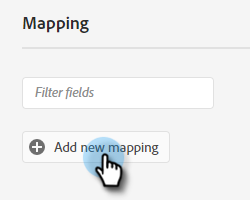

# Adobe Experience Platform セグメントの Marketo 静的リストへのプッシュ {#push-an-adobe-experience-platform-segment-to-a-marketo-static-list}

この機能を使用すると、Adobe Experience Platform にあるセグメントを静的リストの形式で Marketo にプッシュできます。

>[!PREREQUISITES]
>
>* [API ロールの編集](/help/marketo/product-docs/administration/users-and-roles/create-delete-edit-and-change-a-user-role.md#edit-an-existing-role) 確かに **読み取り/書き込み担当者** 権限（アクセス API ドロップダウンの下）
>* Marketo で [API ユーザーを作成](/help/marketo/product-docs/administration/users-and-roles/create-an-api-only-user.md)します。
>* **管理者**／**Launchpoint** に移動します。作成した役割の名前を探し、「**詳細を表示**」をクリックします。手順 7 で必要になるため、**クライアント ID** と&#x200B;**クライアントシークレット**&#x200B;の情報をコピーして保存します。
>* Marketo で、静的リストを作成するか、既に作成した静的リストを見つけて選択します。ID が必要になります。

1. [Adobe Experience Platform](https://experience.adobe.com/) にログインします。

   

1. グリッドアイコンをクリックし、「**Experience Platform**」を選択します。

   

1. 左側のナビゲーションで、「**宛先**」をクリックします。

   

1. 「**カタログ**」をクリックします。

   

1. Marketo Engage タイルを見つけ、「**アクティブ化**」をクリックします。

   

1. 「**新しい宛先を設定**」をクリックします。

   

1. 「アカウントタイプ」で、既存または新規アカウントラジオボタンを選択します（この例では、「**既存アカウント**」）をクリックします。「アカウントを選択」アイコンをクリックします。

   

   >[!NOTE]
   >
   >新規アカウントを選択する場合、**管理者**／**Munchkin** に移動すると、Munchkin ID を見つけることができます（ログイン後の Marketo URL の一部でもあります）。この記事の最上部にある前提条件に従って作成する必要があるクライアント ID／シークレット。

1. 宛先アカウントを選択し、「**選択**」をクリックします。

   

1. 宛先の&#x200B;**名前**&#x200B;とオプションの説明を入力します。「人物作成」ドロップダウンをクリックし、「既存の Marketo の人物に一致および Marketo で見つからない人物を作成」_または_「既存の Marketo の人物に一致のみ」を選択します。この例では、前者を選択しています。

   

   >[!NOTE]
   >
   >「既存の Marketo の人物に一致のみ」を選択した場合は、メールや ECID のマッピングのみ必要なので、手順 13～16 をスキップできます。

1. この節はオプションです。「**作成**」をクリックしてスキップします。

   

1. 作成した宛先を選択し、「**次へ**」をクリックします。

   

1. Marketo に送信するセグメントを選択し、「**次へ**」をクリックします。

   

   >[!NOTE]
   >
   >複数のセグメントを選択する場合は、「セグメントスケジュール」タブで、各セグメントを指定した静的リストにマッピングする必要があります。

   >[!IMPORTANT]
   >
   >セグメントがMarketoの宛先に対して初めてアクティブ化された後は、Marketoの宛先のアクティブ化以前にセグメントに既に存在していたプロファイルのバックフィルに要する場合があります **最大 24 時間**. 今後、プロファイルがセグメントに追加されるたびに、即座にMarketoに追加されます。

1. 「**新規マッピングを追加**」をクリックします。

   

1. マッピングアイコンをクリックします。

   

1. 「**firstName**」を選択して名をマッピングして、「**選択**」をクリックします。

   

1. 姓と会社名に対しても、「**新しいマッピングを追加**」を再度クリックし、**lastName** と **companyName**.を選択して、手順 15 を 2 回繰り返します。

   

1. 次に、メールアドレスをマッピングします。「**新規マッピングを追加**」をもう一度クリックします。

   

1. マッピングアイコンをクリックします。

   

1. 「ID 名前空間を選択」ラジオボタンをクリックし、「**電子メール**」を選択し、「**選択**」をクリックします。

   

   >[!IMPORTANT]
   >
   >「**ID 名前空間**」タブからのメールや ECID のマッピングは、Marketo で人物を一致させるために最も重要です。メールのマッピングは、最も高い一致率を保証します。

1. それでは、ソースフィールドを選択しましょう。メールの場合は、カーソルアイコンをクリックします。

   

1. 「ID 名前空間を選択」ラジオボタンをクリックし、「**電子メール**」を選択し、「**選択**」をクリックします。

   

1. 「会社名」ソースフィールドを選択するには、その行のカーソルアイコンをクリックします。

   

1. 「属性を選択」ラジオボタンは選択したままにします。「company」を検索し、「**companyName**」を選択して、「**選択**」をクリックします。

   

1. 姓と名に対しても、カーソルアイコンを再度クリックし、**lastName** と **firstName**.を選択して、手順 23 を 2 回繰り返します。

   

1. 「**次へ**」をクリックします。

   

1. ここで、リストの ID が必要になります。ブラウザーで Marketo 静的リストを開いているタブをクリックします（または新しいタブを開いて、目的の静的リストを選択します）。

   

   >[!NOTE]
   >
   >最適な結果を得るには、空の Marketo Engage リストを使用します。

1. URL の末尾にあるリスト ID をハイライトしてコピーします。

   

1. コピーした ID を「マッピング ID 」の下に貼り付け、「**次へ**」をクリックします。

   

1. 「**終了**」をクリックします。

   
