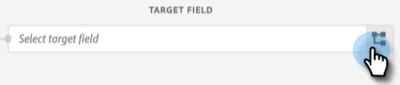

# Adobe Experience Platform セグメントの Marketo 静的リストへのプッシュ {#push-an-adobe-experience-platform-segment-to-a-marketo-static-list}

この機能を使用すると、Adobe Experience Platform にあるセグメントを静的リストの形式で Marketo Engage にプッシュできます。

>[!PREREQUISITES]
>
>* [API ロールを編集](/help/marketo/product-docs/administration/users-and-roles/create-delete-edit-and-change-a-user-role.md#edit-an-existing-role){target="_blank"}して、**読み取り／書き込み**&#x200B;権限を持つようにします（アクセス API ドロップダウン下にあります）。
>* Marketo で [API ユーザを作成](/help/marketo/product-docs/administration/users-and-roles/create-an-api-only-user.md){target="_blank"}します。
>* **[!UICONTROL 管理者]**／**[!UICONTROL Launchpoint]** に移動します。作成したロールの名前を探し、「**[!UICONTROL 詳細を表示]**」をクリックします。手順 7 で必要になるため、**[!UICONTROL クライアント ID]** と&#x200B;**[!UICONTROL クライアントシークレット]**&#x200B;の情報をコピーして保存します。
>* Marketo で、静的リストを作成するか、既に作成した静的リストを見つけて選択します。ID が必要になります。

1. [Adobe Experience Platform](https://experience.adobe.com/){target="_blank"} にログインします。

   

1. グリッドアイコンをクリックし、「**[!UICONTROL Experience Platform]**」を選択します。

   

1. 左側のナビゲーションで、「**[!UICONTROL 宛先]**」をクリックします。

   

1. 「**[!UICONTROL カタログ]**」をクリックします。

   

1. Marketo Engage タイルを見つけ、「**[!UICONTROL アクティブ化]**」をクリックします。

   

1. 「**[!UICONTROL 新しい宛先を設定]**」をクリックします。

   

1. 「アカウントタイプ」で、既存または新規アカウントラジオボタンを選択します（この例では、「**[!UICONTROL 既存アカウント]**」）をクリックします。「アカウントを選択」アイコンをクリックします。

   

   >[!NOTE]
   >
   >新規アカウントを選択する場合、**[!UICONTROL 管理者]**／**[!UICONTROL Munchkin]** に移動すると、Munchkin ID を見つけることができます（ログイン後の Marketo URL の一部でもあります）。この記事の最上部にある前提条件に従って作成する必要があるクライアント ID／シークレット。

1. 宛先アカウントを選択し、「**[!UICONTROL 選択]**」をクリックします。

   

1. 宛先の&#x200B;**[!UICONTROL 名前]**&#x200B;とオプションの説明を入力します。人物作成ドロップダウンをクリックし、「既存の Marketo の人物に一致および Marketo で見つからない人物を作成」_または_「既存の Marketo の人物のみに一致」を選択します（この例では前者を選択しています）。また、**[!UICONTROL ワークスペース]**&#x200B;を選択する必要があります。

   

   >[!NOTE]
   >
   >「[!UICONTROL  既存のMarketo ユーザーのみを一致 ]」を選択した場合は、メールまたは ECID をマッピングするだけで済むので、手順 13～16 をスキップできます。

1. この節はオプションです。「**[!UICONTROL 作成]**」をクリックしてスキップします。

   

1. 作成した宛先を選択し、「**[!UICONTROL 次へ]**」をクリックします。

   

1. Marketo に送信するセグメントを選択し、「**[!UICONTROL 次へ]**」をクリックします。

   

   >[!NOTE]
   >
   >複数のセグメントを選択する場合は、「[!UICONTROL  セグメントスケジュール ]」タブで、各セグメントを指定された静的リストにマッピングする必要があります。

   >[!IMPORTANT]
   >
   >セグメントが Marketo の宛先に対して初めてアクティブ化された後は、Marketo の宛先のアクティブ化以前にセグメントに既に存在していたプロファイルのバックフィルに、_最大 24 時間_&#x200B;かかる場合があります。今後、プロファイルがセグメントに追加されるたびに、即座に Marketo に追加されます。

1. 「**[!UICONTROL 新規マッピングを追加]**」をクリックします。

   

1. マッピングアイコンをクリックします。

   

1. 目的の属性を選択し、「**[!UICONTROL 選択]**」をクリックします。この例では、名、姓、メールアドレスを選択しています。

   

   >[!NOTE]
   >
   >Experience Platform の属性を、組織が Marketo Engage でアクセスできる任意の属性にマッピングできます。[API リクエストの説明 ](https://experienceleague.adobe.com/ja/docs/marketo-developer/marketo/rest/lead-database/lead-database#describe){target="_blank"} を使用して、組織がアクセスできる属性フィールドを取得します。

1. 姓と会社名に対しても、「**[!UICONTROL 新しいマッピングを追加]**」を再度クリックし、**[!UICONTROL lastName]** と **[!UICONTROL companyName]**.を選択して、手順 15 を 2 回繰り返します。

   

1. 次に、メールアドレスをマッピングします。「**[!UICONTROL 新規マッピングを追加]**」をもう一度クリックします。

   

1. マッピングアイコンをクリックします。

   

1. 「ID 名前空間を選択」ラジオボタンをクリックし、「**[!UICONTROL メール]**」を選択して、「**[!UICONTROL 選択]**」をクリックします。

   

   >[!IMPORTANT]
   >
   >「**[!UICONTROL ID 名前空間]**」タブからのメールや ECID のマッピングは、Marketo で人物を一致させるために最も重要です。メールのマッピングは、最も高い一致率を保証します。

1. それでは、ソースフィールドを選択しましょう。メールの場合は、カーソルアイコンをクリックします。

   

1. 「ID 名前空間を選択」ラジオボタンをクリックし、「**[!UICONTROL 電子メール]**」を選択し、「**[!UICONTROL 選択]**」をクリックします。

   

1. 「会社名」ソースフィールドを選択するには、その行のカーソルアイコンをクリックします。

   

1. 「属性を選択」ラジオボタンは選択したままにします。「company」を検索し、「**[!UICONTROL companyName]**」を選択して、「**[!UICONTROL 選択]**」をクリックします。

   

1. 姓と名に対しても、カーソルアイコンを再度クリックし、**[!UICONTROL lastName]** と **[!UICONTROL firstName]**.を選択して、手順 23 を 2 回繰り返します。

   

1. 「**[!UICONTROL 次へ]**」をクリックします。

   

1. 変更を確認し、「**[!UICONTROL 完了]**」をクリックします。

   
