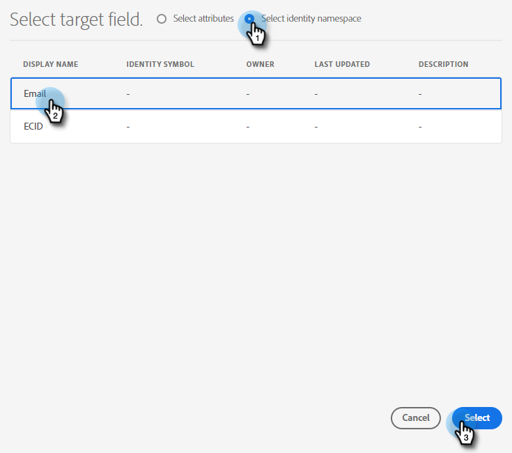

# 複製をプッシュ {#push-clone}

この機能を使用すると、Adobe Experience Platform にあるセグメントを静的リストの形式で Marketo にプッシュできます。

>[!PREREQUISITES]
>
>* Marketo で [API ユーザーを作成](/help/marketo/product-docs/administration/users-and-roles/create-an-api-only-user.md)します。
>* 次に、**管理**／ **Launchpoint** に移動します。作成した役割の名前を探し、「**詳細を表示**」をクリックします。この機能に必要なので、**クライアント ID** と&#x200B;**クライアントシークレット**&#x200B;の情報をコピーして保存します。
>* Marketo で、静的リストを作成するか、既に作成した静的リストを見つけて選択します。ID が必要になります。

1. [Adobe Experience Platform](https://experience.adobe.com/) にログインします。

   

1. グリッドアイコンをクリックし、「**Experience Platform**」を選択します。

   

1. 左側のナビゲーションで、「**宛先**」をクリックします。

   

1. 「**カタログ**」をクリックします。

   

1. 「Marketo Engage」タイルを探し、 **セグメントのアクティブ化**.

   

1. クリック **新しい宛先の設定**.

   

1. 「アカウントタイプ」で、「既存または新規のアカウント」ラジオボタンを選択します ( この例では、 **既存のアカウント**) をクリックします。 「アカウントを選択」アイコンをクリックします。

   

   >[!NOTE]
   >
   >新しいアカウントを選択している場合は、 **管理者** > **Munchkin** ( ログイン後のMarketo URL の一部でもあります )。 この記事の最上部にある前提条件に従って作成する必要があるクライアント ID／シークレット。

1. 宛先アカウントを選択し、 **選択**.

   

1. 宛先を入力 **名前** およびオプションの説明。 「人物の作成」ドロップダウンをクリックし、「既存のMarketoの人物を照合」および「Marketoで見つからない人物を作成」を選択します。 _または_ 「既存のMarketoの担当者のみに一致」 この例では、前者を選択しています。

   

   >[!NOTE]
   >
   >「既存のMarketoのユーザーのみを一致」を選択した場合は、電子メールや ECID のマッピングのみが必要なので、手順 13 ～ 16 をスキップできます。

1. この節はオプションです。 クリック **作成** スキップします。

   

1. 作成した宛先を選択し、「 **次へ**.

   

1. Marketoに送信するセグメントを選択し、 **次へ**.

   

   >[!NOTE]
   >
   >ここで複数のセグメントを選択する場合は、「セグメントスケジュール」タブで、各セグメントを指定した静的リストにマッピングする必要があります。

1. 「**新規マッピングを追加**」をクリックします。

   

1. マッピングアイコンをクリックします。

   

1. 「 」を選択して名をマッピング **firstName** をクリックし、 **選択**.

   

1. 「 **新しいマッピングを追加** を繰り返し、手順 15 を 2 回繰り返し、を選択します。 **lastName** その後 **companyName**.

   

1. 次に、E メールアドレスをマッピングします。 クリック **新しいマッピングを追加** 再び

   

1. マッピングアイコンをクリックします。

   

1. 「 ID 名前空間を選択」ラジオボタンをクリックし、「  **電子メール**&#x200B;を選択し、「 **選択**.

   

   >[!IMPORTANT]
   >
   >電子メールや ECID の **ID 名前空間** 「 」タブは、Marketoでユーザーが一致するようにするための最も重要な操作です。 マッピングメールは、最も高い一致率を保証します。

1. 次に、ソースフィールドを選択します。 電子メールの場合は、カーソルアイコンをクリックします。

   

1. 「 ID 名前空間を選択」ラジオボタンをクリックし、「検索」をクリックして「 **電子メール**&#x200B;を選択し、「 **選択**.

   

1. 「会社名」ソースフィールドを選択するには、行のカーソルアイコンをクリックします。

   

1. 「属性を選択」ラジオボタンは選択したままにします。 「company」を検索し、「 **companyName**&#x200B;を選択し、「 **選択**.

   

1. それぞれのカーソルアイコンをクリックし、手順 23 を 2 回繰り返して、姓と名のソースフィールドをマッピングします。次に、 **lastName** その後 **firstName**.

   

1. 「**次へ**」をクリックします。

   

1. 次に、リストの ID が必要になります。 ブラウザーでMarketo静的リストを開いているタブをクリックします（または新しいタブを開いて、目的の静的リストを選択します）。

   

   >[!NOTE]
   >
   >最適な結果を得るには、空のMarketo Engageリストを使用します。

1. URL の末尾にあるリスト ID をハイライトしてコピーします。

   

1. コピーした ID を「マッピング ID 」の下に貼り付け、「 」をクリックします。 **次へ**.

   

1. 「**終了**」をクリックします。

   
