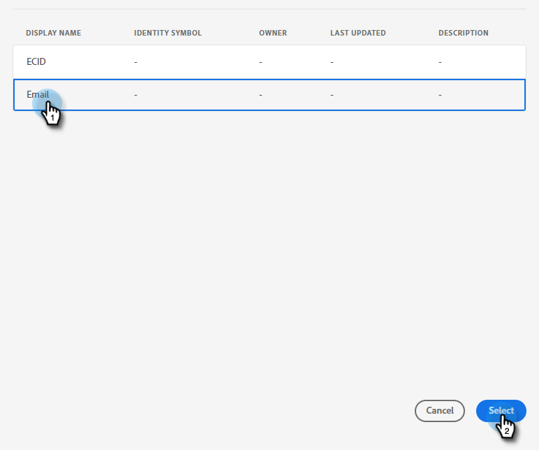

# 複製をプッシュ {#push-clone}

この機能を使用すると、Adobe Experience Platform にあるセグメントを静的リストの形式で Marketo にプッシュできます。

>[!PREREQUISITES]
>
>* Marketo で [API ユーザーを作成](/help/marketo/product-docs/administration/users-and-roles/create-an-api-only-user.md)します。
>* 次に、**管理**／ **Launchpoint** に移動します。作成した役割の名前を探し、「**詳細を表示**」をクリックします。この機能に必要なので、**クライアント ID** と&#x200B;**クライアントシークレット**&#x200B;の情報をコピーして保存します。

1. [Adobe Experience Platform](https://experience.adobe.com/) にログインします。

   

1. グリッドアイコンをクリックし、「**Experience Platform**」を選択します。

   

1. 左側のナビゲーションで、「**宛先**」をクリックします。

   

1. 「**カタログ**」をクリックします。

   

1. 「Marketo Engage」タイルを探し、 **セグメントのアクティブ化**.

   

1. クリック **新しい宛先の設定**.

1. 「アカウントタイプ」で、「既存のアカウント」または「 **新規アカウント** ラジオボタン ( この例では、 **新規アカウント**) をクリックします。 Marketo資格情報を入力します。

   

   >[!NOTE]
   >
   >**管理**／ **Munchkin** に移動すると、Munchkin ID を見つけることができます（ログイン後の Marketo URL の一部でもあります）。この記事の最上部にある前提条件に従って作成する必要があるクライアント ID／シークレット。

1. 「担当者の作成」で、「既存の担当者のみを一致」または「既存の担当者を一致させ、Marketoで見つからない担当者を作成」を選択します。 このオプションでは、後者を選択します。

PICC

1. 「接続済み」が資格情報の下に表示されます。右上隅の「**次へ**」をクリックします。

   

1. **名前**&#x200B;と&#x200B;_オプションの_&#x200B;説明を入力します。「**宛先を作成**」をクリックします。

   >[!NOTE]
   >
   >マーケティングアクションからの選択もオプションです。Marketo では、現時点ではその情報を活用していませんが、近日中に活用するようになる可能性が高いです。

   

1. 「**次へ**」をクリックします。

   

1. 目的のセグメントを選択し、「**次へ**」をクリックします。

   

   >[!NOTE]
   >
   >ここで複数のセグメントを選択する場合は、「セグメントスケジュール」タブで、各セグメントを指定した静的リストにマッピングする必要があります。

1. 「**新規マッピングを追加**」をクリックします。

   

1. カーソルアイコンをクリックします。

   

1. 次のいずれかを選択します。 **属性を選択** または **ID 名前空間を選択** ラジオボタン（この例では、「属性」を選択します）。

   

   >[!NOTE]
   >
   >次を選択した場合： **ID 名前空間を選択**&#x200B;を選択した後、手順 15 に進みます。

1. ユーザーを識別するメールアドレスを含む関連フィールドを選択します。終了したら「**選択**」をクリックします。

   

   

   >[!NOTE]
   >
   >選択した例は、実際のものとは大きく異なる場合があります。

1. マッピングアイコンをクリックします。

   

1. 選択 **ID 名前空間を選択**.

   

   >[!IMPORTANT]
   >
   >マッピング属性はオプションです。 電子メールや ECID の **ID 名前空間** 「 」タブは、Marketoでユーザーが一致するようにするための最も重要な操作です。 マッピングメールは、最も高い一致率を保証します。

1. 「ECID」か「電子メール」のどちらかを選択します。 この例では、を選択しています。 **電子メール**.

   

1. 「**次へ**」をクリックします。

   

   >[!NOTE]
   >
   >ID は、Marketoで一致を検索するために使用されます。 一致が見つかった場合、そのユーザーは静的リストに追加されます。 一致が見つからない場合、そのユーザーは削除されます ( つまり、Marketoで作成されません )。

1. _Marketo_ で、静的リストを作成するか、既に作成した静的リストを見つけて選択します。URL の末尾からマッピング ID をコピーします。

   

   >[!NOTE]
   >
   >最良の結果を得るには、Marketo で参照するリストが空であることを確認してください。

1. Adobe Experience Platform に戻り、コピーした ID を入力します。「開始日」を選択します。選択された終了日まで同期が続きます。無期限同期の場合は、終了日を空白のままにします。終了したら「**次へ**」をクリックします。

   

1. 変更を確認し、「**完了**」をクリックします。

   
