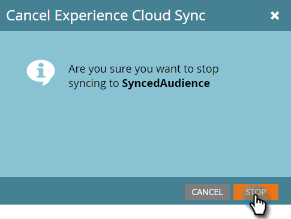

# リストをAdobe Experience Cloudに送信{#send-a-list-to-adobe-experience-cloud}

>[!NOTE]
>
>MarketoインスタンスのHIPAA対応の展開では、この機能を使用できません。

>[!PREREQUISITES]
>
>[Adobe Experience Cloudオーディエンス共有の設定](/help/marketo/product-docs/core-marketo-concepts/miscellaneous/set-up-adobe-experience-cloud-audience-sharing.md)

## サポートされる宛先アプリケーション{#supported-destination-applications}

* Adobe Advertising Cloud
* Adobe Analytics(Adobe Audience Managerのライセンスを所有している場合は&#x200B;**のみ**)
* Adobe Audience Manager
* Adobe Experience Manager
* Adobeリアルタイム顧客データプラットフォーム
* Adobe Target

## 静的リストの送信方法{#how-to-send-a-static-list}

静的なリストは静的です 手動で行わない限り、Adobe Experience Cloudのリストは変更されません。

1. Marketoで、書き出すリストを探して選択します。

   

1. **リストアクション**&#x200B;ドロップダウンをクリックし、**Experience Cloudに送信**&#x200B;を選択します。

   

1. 「**Audience Managerフォルダー**」ドロップダウンをクリックし、Experience Cloudー内の目的の保存先フォルダーを選択します。

   

1. 新しいオーディエンスを作成するか、既存のフォルダを上書きするかを選択します（この例では、新しいを作成します）。 新しいオーディエンス名を入力し、「**送信**」をクリックします。

   

1. 「**OK**」をクリックします。

   

   >[!NOTE]
   >
   >オーディエンスのメンバーシップがAdobeに完全に設定されるまで、最大6 ～ 8時間かかる場合があります。

## 同期リストの送信方法{#how-to-send-a-synced-list}

リストを同期すると、Marketoでリストを更新したときに、その変更が自動的にAdobe Experience Cloudのオーディエンスに同期されます。

1. Marketoで、同期するリストを探して選択します。

   

1. **リストアクション**&#x200B;ドロップダウンをクリックし、**Experience Cloudに送信**&#x200B;を選択します。

   

1. 「**オーディエンスライブラリフォルダー**」ドロップダウンをクリックし、Experience Cloudー内の目的のフォルダーを選択します。

   

1. 新しいオーディエンスを作成するか、既存のフォルダを上書きするかを選択します（この例では、新しいを作成します）。 新しいオーディエンス名を入力し、「**オーディエンスのメンバーシップを同期**&#x200B;に保持」ボックスをオンにして、「**送信**」をクリックします。

   

1. 「**OK**」をクリックします。

   

## リスト同期を停止する方法{#how-to-stop-a-list-sync}

リストの同期はいつでも停止できます。

1. Marketoで、同期を停止するリストを探して選択します。

   

1. 「**リストの操作**」ドロップダウンをクリックし、「**リストの同期を停止**」を選択します。

   

1. 同期を停止するオーディエンスを選択し、「**停止**」をクリックします。

   

1. 「**停止**」をクリックして確認します。

   

## 注意事項{#things-to-note}

**Adobe Analyticsとの共有**

Adobe Audience ManagerとAdobe Analyticsの両方を所有するお客様に対しては、この統合により、オーディエンスをMarketoからAdobe Analyticsレポートスイートに共有できるようになります。ただし、Adobe Audience Managerでこれを有効にするために、いくつかの追加の設定手順を行う必要があります。 この設定方法の詳細については、Adobe Audience Managerのドキュメントを参照してください。[https://docs.adobe.com/content/help/en/analytics/integration/audience-analytics/mc-audiences-aam.html](https://docs.adobe.com/content/help/en/analytics/integration/audience-analytics/mc-audiences-aam.html).

**Adobe Audience Managerのお客様の特徴使用**

Marketoでリストの書き出しを開始すると、Adobe Audience Managerのインスタンスに次の変更が反映されています。

* エクスポートされたリスト内のすべてのリードについて、Marketoは、リードのハッシュされた電子メールをCross-Device Identifierとして使用して特性を書き込みます。 特性の名前は、エクスポート時に指定した宛先オーディエンス名と一致します。
* Marketoがエクスポートしたリストのリードと照合するために管理したすべてのECIDに対して、MarketoはECID Device Identifierを使用して特性を記述します。 特性の名前は、エクスポート時に指定した宛先オーディエンス名と一致します。
* また、Marketoは、ECID特性をセグメント化基準として使用し、Audience Managerインスタンスにセグメントを作成します。 セグメントの名前は、エクスポート時に指定した宛先オーディエンス名と一致します。

## FAQ {#faq}

**MarketoのリストサイズとAdobeのサイズが異なるのはなぜですか。**

内部では、オーディエンス統合は、Marketoマンチキンcookieと対応するAdobeECID cookieを同期することで機能します。 Marketoは、MarketoがECIDを同期したリードのメンバーシップデータのみを共有できます。 最良の結果を得るために、マーケティングのためのトラッキングに関心のあるすべてのページに関するAdobeの訪問者.jsトラッキングコードと並行して、Marketoのmunchkin.jsトラッキングスクリプトを読み込むことをお勧めします。

**cookieの同期はどのように行われますか。**

Marketoのmunchkin.jsは、Marketo購読でcookie同期が有効になっている場合、統合の設定時に指定したAdobeIMS組織のAdobeECIDを取得して保存し、これらのECIDを対応するMarketocookie識別子に一致させようとします。 これにより、Marketoの匿名ユーザープロファイルは、AdobeECIDを使用してより多くの情報を得ることができます。

匿名ユーザープロファイルをリードプロファイルに関連付けるには、さらに手順が必要です。リードユーザーは、テキスト形式の電子メールを使用して識別されます。 に記述されているとおり、この動作は正確に表示されます。

**どの情報が共有されているか**

この統合では、MarketoからAdobeにリストのメンバーシップ情報のみを共有します(例えば、リードXがリストYのメンバーであるという知識)。 この統合を介して、追加のリード属性はAdobeに共有されません。
