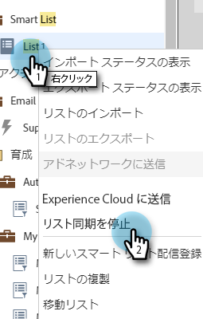

# Adobe Experience Cloud へのリストの送信 {#send-a-list-to-adobe-experience-cloud}

>[!NOTE]
>
>Marketoインスタンスの HIPAA 対応のデプロイメントでは、この機能を使用できません。

>[!PREREQUISITES]
>
>[Adobe Experience Cloud オーディエンス共有のセットアップ](/help/marketo/product-docs/core-marketo-concepts/miscellaneous/set-up-adobe-experience-cloud-audience-sharing.md)

## サポートされる宛先アプリケーション {#supported-destination-applications}

* Adobe Advertising Cloud
* Adobe Analytics (**のみ** (Adobe Audience Managerライセンスを所有している場合 )
* Adobe Audience Manager
* Adobe Experience Manager
* Adobe Real-time Customer Data Platform
* Adobe Target

## 静的リストの送信方法 {#how-to-send-a-static-list}

静的リストは、静的リストに過ぎません。 手動で変更しない限り、Adobe Experience Cloudのリストは変更されません。

1. Marketoで、書き出すリストを見つけます。 右クリックし、「 」を選択します。 **送信先Experience Cloud**.

   

1. 次をクリック： **Audience Managerフォルダー** 」ドロップダウンリストから、目的の宛先フォルダーを「 」Experience Cloudで選択します。

   

1. 新しいオーディエンスを作成するか、既存のオーディエンスを上書きするかを選択します（この例では、新しいオーディエンスを作成します）。 新しいオーディエンス名を入力し、 **送信**.

   

1. 「**OK**」をクリックします。

   

   >[!NOTE]
   >
   >オーディエンスのメンバーシップがAdobeに完全に設定されるまで、最大 6 ～ 8 時間かかる場合があります。

## 同期済みリストの送信方法 {#how-to-send-a-synced-list}

リストの同期とは、Marketoでリストを更新したときに、その変更がAdobe Experience Cloudのオーディエンスに自動的に同期されることを意味します。

1. Marketoで、書き出すリストを見つけます。 右クリックし、「 」を選択します。 **送信先Experience Cloud**.

   

1. 次をクリック： **オーディエンスライブラリフォルダー** 」ドロップダウンリストから、目的の宛先フォルダーを「 」Experience Cloudで選択します。

   

1. 新しいオーディエンスを作成するか、既存のオーディエンスを上書きするかを選択します（この例では、新しいオーディエンスを作成します）。 新しいオーディエンス名を入力し、 **オーディエンスメンバーシップの同期を維持** ボックスで、 **送信**.

   

1. 「**OK**」をクリックします。

   

## リストの同期を停止する方法 {#how-to-stop-a-list-sync}

リストの同期は、いつでも停止できます。

1. Marketoで、同期を停止するリストを探して右クリックします。 クリック **リストの同期を停止**.

   

1. 同期を停止するオーディエンスを選択し、「 **停止**.

   

1. クリック **停止** をクリックして確定します。

   

## 注意事項 {#things-to-note}

**Adobe Analyticsとの共有**

Adobe Audience ManagerとAdobe Analyticsの両方を所有しているお客様は、この統合を使用してMarketoからAdobe Analyticsレポートスイートにオーディエンスを共有できますが、これを有効にするには、Adobe Audience Managerでおこなう必要のある追加の設定手順があります。 この設定方法の詳細については、Adobe Audience Managerのドキュメントを参照してください。 [https://experienceleague.adobe.com/docs/analytics/integration/audience-analytics/mc-audiences-aam.html](https://experienceleague.adobe.com/docs/analytics/integration/audience-analytics/mc-audiences-aam.html).

**Adobe Audience Managerのお客様向けの特性の使用**

Marketoでリストの書き出しを開始すると、Adobe Audience Managerインスタンスに次の変更が反映されています。

* 書き出されたリスト内のすべてのリードに対して、Marketoは、リードのハッシュ化された電子メールをクロスデバイス識別子として使用する特性を書き込みます。 特性の名前は、エクスポート時に指定した Destination Audience Name に一致します。
* 書き出されたリスト内のリードとMarketoが一致させて管理しているすべての ECID に対して、Marketoは ECID デバイス識別子を使用して特性を書き込みます。 特性の名前は、エクスポート時に指定した Destination Audience Name に一致します。
* また、Marketoは、ECID 特性を唯一のAudience Manager条件として使用して、セグメントインスタンスにセグメントを作成します。 セグメントの名前は、エクスポート時に指定した Destination Audience Name に一致します。

## よくある質問 {#faq}

**MarketoのリストサイズがAdobeのリストサイズと異なるのはなぜですか？**

内部で、オーディエンス統合は、Marketo Munchkin Cookie を対応するAdobeECID Cookie と同期することで機能します。 Marketoは、Marketoが ECID を同期したリードのメンバーシップデータのみを共有できます。 可能な限り最良の結果を得るには、マーケティング目的でトラッキングしたいすべてのページで、Marketoの munchkin.js トラッキングスクリプトをAdobeの visitor.js トラッキングコードと並行して読み込むことをお勧めします。

**Cookie の同期の仕組み**

Marketoサブスクリプションに対して cookie 同期が有効になっている場合、Marketoの munchkin.js は、統合の設定時に指定したAdobe IMS組織のAdobeECID を取得して保存し、これらの ECID を対応するMarketoの Cookie 識別子に一致させます。 これにより、Marketoの匿名ユーザープロファイルをAdobeECID で強化できます。

匿名ユーザープロファイルをリードプロファイルに関連付けるには、さらに手順を実行する必要があります。リードプロファイルは、テキスト形式の電子メールで識別されます。 この機能の正確な仕組み [ここで説明](/help/marketo/product-docs/reporting/basic-reporting/report-activity/tracking-anonymous-activity-and-people.md).

**どの情報が共有されていますか？**

この統合は、MarketoからAdobeにリストメンバーシップ情報のみを共有します（例えば、リード X がリスト Y のメンバーであるという知識）。 この統合を介して、追加のリード属性がAdobeに共有されることはありません。
