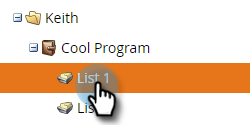
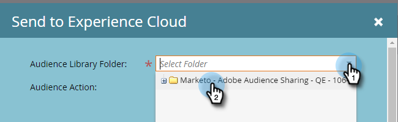
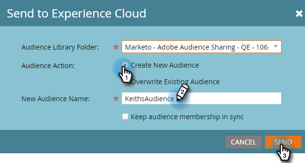
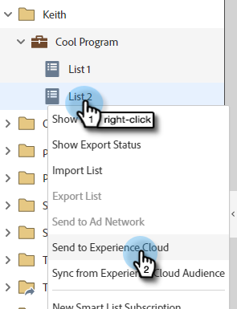
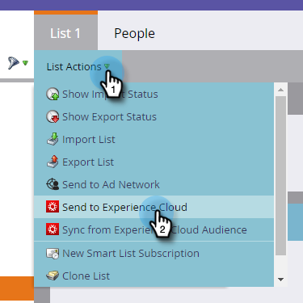
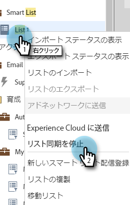
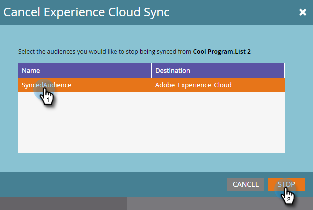
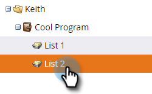

# Adobe Experience Cloud へのリストの送信 {#send-a-list-to-adobe-experience-cloud}

>[!NOTE]
>
>Marketo Engage インスタンスの HIPAA 対応デプロイメントでは、この機能を使用できません。

>[!PREREQUISITES]
>
>[アドビ組織マッピングの設定](/help/marketo/product-docs/adobe-experience-cloud-integrations/set-up-adobe-organization-mapping.md){target="_blank"}

## サポートされる宛先アプリケーション {#supported-destination-applications}

* Adobe Advertising Cloud
* Adobe Analytics（Adobe Audience Manager ライセンスを所有している場合&#x200B;_のみ_）
* Adobe Audience Manager
* Adobe Experience Manager
* Adobe Real-time Customer Data Platform
* Adobe Target

## 静的リストの送信方法 {#how-to-send-a-static-list}

静的リストは静的です。 手動で変更しない限り、Adobe Experience Cloud のリストは変更されません。

1. Marketo で、エクスポートするリストを探します。 右クリックし、「**[!UICONTROL Experience Cloud]** に送信」を選択します。

   

1. 「**[!UICONTROL Audience Manager フォルダー]**」ドロップダウンリストをクリックして、Experience Cloud の目的の宛先フォルダーを選択します。

   

1. 新しいオーディエンスを作成するか、既存のオーディエンスを上書きするかを選択します（この例では、新しいオーディエンスを作成します）。 新しいオーディエンス名を入力し、「**[!UICONTROL 送信]**」をクリックします。クリックします。

   

1. 「**[!UICONTROL OK]**」をクリックします。

   

   >[!NOTE]
   >
   >オーディエンスのメンバーシップがアドビに完全に設定されるまで、最大 6～8 時間かかる場合があります。

## 同期済みリストの送信方法 {#how-to-send-a-synced-list}

リストの同期とは、Marketo でリストを更新したときに、その変更が Adobe Experience Cloud のオーディエンスに自動的に同期されることを意味します。

1. Marketo で、エクスポートするリストを探します。 右クリックし、「**[!UICONTROL Experience Cloud]** に送信」を選択します。

   

1. 「**[!UICONTROL オーディエンスライブラリフォルダー]**」ドロップダウンリストをクリックして、Experience Cloud の目的の宛先フォルダーを選択します。

   

1. 新しいオーディエンスを作成するか、既存のオーディエンスを上書きするかを選択します（この例では、新しいオーディエンスを作成します）。 新しいオーディエンス名を入力し、「**[!UICONTROL オーディエンスメンバーシップの同期を維持]**」ボックスで、「**[!UICONTROL 送信]**」をクリックします。

   

1. 「**[!UICONTROL OK]**」をクリックします。

   

## リストの同期を停止する方法 {#how-to-stop-a-list-sync}

リストの同期は、いつでも停止できます。

1. Marketo で、同期を停止するリストを探して右クリックします。 「**[!UICONTROL リスト同期を停止]**」をクリックします。

   

1. 同期を停止するオーディエンスを選択し、「**[!UICONTROL 停止]**」をクリックします。

   

1. 「**[!UICONTROL 停止]**」をクリックして確認します。

   

## 注意事項 {#things-to-note}

### Adobe Analyticsへの共有 {#sharing-to-adobe-analytics}

* Adobe Audience ManagerとAdobe Analyticsの両方を所有しているユーザーの場合、この統合によりMarketoからAdobe Analytics レポートスイートにオーディエンスを共有できますが、これを有効にするにはAdobe Audience Managerでさらに設定を行う必要があります。 この設定方法について詳しくは、[Adobe Audience Managerのドキュメント &#x200B;](https://experienceleague.adobe.com/docs/analytics/integration/audience-analytics/mc-audiences-aam.html?lang=ja?lang=ja){target="_blank"}を参照してください。

* MarketoからAdobe Audience Managerにリストをアップロードした後は、Adobe Targetからもアクセスできます。 この設定[は、Adobe Target](https://experienceleague.adobe.com/en/docs/target/using/integrate/audience-manager-target-integration){target="_blank"}で有効にする必要があります。

* リストが空の場合、またはECID値を持つユーザーが存在しない場合、リスト名はMarketo外で参照されるようにプッシュされません。

### Adobe Audience Managerのお客様の特性使用状況 {#trait-usage-aam}

Marketoでリストの書き出しを開始すると、Adobe Audience Manager インスタンスに次の変更が反映されます。

* Marketo は、エクスポートされたリスト内のすべての人物に対して、ハッシュ化されたメールをクロスデバイス識別子として使用して特性を書き込みます。 特性の名前は、エクスポート時に指定した宛先オーディエンス名に一致します。
* エクスポートされたリスト内の人物と Marketo が一致させて管理しているすべての ECID に対して、Marketo は ECID デバイス識別子を使用して特性を書き込みます。 特性の名前は、エクスポート時に指定した宛先オーディエンス名に一致します。
* また、Marketo は、ECID 特性を唯一の条件として使用して、セグメントを Audience Manager インスタンスに作成します。 セグメントの名前は、エクスポート時に指定した宛先オーディエンス名に一致します。

## よくある質問 {#faq}

**Marketo のリストサイズがアドビのリストサイズと異なるのはなぜですか？**

オーディエンス統合は、内部で、Marketo Munchkin Cookie を対応する Adobe ECID Cookie と同期することで機能します。 Marketo は、Marketo が ECID を同期した人物のメンバーシップデータのみを共有できます。 可能な限り最良の結果を得るには、マーケティング目的でトラッキングを行う対象のすべてのページに、Marketoのmunchkin.js トラッキングスクリプトとAdobeのvisitor.js トラッキングコードを並行して読み込むことをお勧めします。

**Cookie の同期は、どのよう仕組みなのですか？**

Marketo サブスクリプションに対して Cookie 同期が有効になっている場合、Marketo の munchkin.js は、統合の設定時に指定した Adobe IMS 組織の Adobe ECID を取得して保存し、その ECID を対応する Marketo の Cookie 識別子に一致させます。 これにより、Marketo の匿名ユーザプロファイルを Adobe ECID で強化できます。

匿名ユーザプロファイルをユーザプロファイルに関連付けるには、さらに手順を実行する必要があります。ユーザプロファイルは、テキスト形式メールで識別されます。 この機能の正確な仕組みは、[こちらで説明しています](/help/marketo/product-docs/reporting/basic-reporting/report-activity/tracking-anonymous-activity-and-people.md){target="_blank"}。

**どの情報が共有されますか？**

この統合では、Marketo からアドビにリストメンバーシップ情報のみを共有します（例えば、ユーザ X はリスト Y のメンバーであるという知識）。 この統合を介して、追加のユーザ属性がアドビに共有されることはありません。
