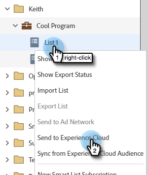

# Adobe Experience Cloud へのリストの送信 {#send-a-list-to-adobe-experience-cloud}

>[!NOTE]
>
>Marketo インスタンスの HIPAA 対応デプロイメントでは、この機能を使用できません。

>[!PREREQUISITES]
>
>[組織マッピングAdobeの設定](/help/marketo/product-docs/adobe-experience-cloud-integrations/set-up-adobe-organization-mapping.md){target=&quot;_blank&quot;}

## サポートされる宛先アプリケーション {#supported-destination-applications}

* Adobe Advertising Cloud
* Adobe Analytics（Adobe Audience Manager ライセンスを所有している場合&#x200B;**のみ**）
* Adobe Audience Manager
* Adobe Experience Manager
* Adobe Real-time Customer Data Platform
* Adobe Target

## 静的リストの送信方法 {#how-to-send-a-static-list}

静的リストは、その名のとおり、静的です。手動で変更しない限り、Adobe Experience Cloud のリストは変更されません。

1. Marketoで、書き出すリストを見つけます。 右クリックし、「 」を選択します。 **送信先Experience Cloud**.

   

1. 「**Audience Manager フォルダー**」ドロップダウンリストをクリックして、Experience Cloud の目的の宛先フォルダーを選択します。

   

1. 新しいオーディエンスを作成するか、既存のオーディエンスを上書きするかを選択します（この例では、新しいオーディエンスを作成します）。新しいオーディエンス名を入力し、「**送信**」をクリックします。クリックします。

   

1. 「**OK**」をクリックします。

   

   >[!NOTE]
   >
   >オーディエンスのメンバーシップがアドビに完全に設定されるまで、最大 6～8 時間かかる場合があります。

## 同期済みリストの送信方法 {#how-to-send-a-synced-list}

リストの同期とは、Marketo でリストを更新したときに、その変更が Adobe Experience Cloud のオーディエンスに自動的に同期されることを意味します。

1. Marketoで、書き出すリストを見つけます。 右クリックし、「 」を選択します。 **送信先Experience Cloud**.

   

1. 「**オーディエンスライブラリフォルダー**」ドロップダウンリストをクリックして、Experience Cloud の目的の宛先フォルダーを選択します。

   

1. 新しいオーディエンスを作成するか、既存のオーディエンスを上書きするかを選択します（この例では、新しいオーディエンスを作成します）。新しいオーディエンス名を入力し、「**オーディエンスメンバーシップの同期を維持**」ボックスで、「**送信**」をクリックします。

   

1. 「**OK**」をクリックします。

   

## リストの同期を停止する方法 {#how-to-stop-a-list-sync}

リストの同期は、いつでも停止できます。

1. Marketoで、同期を停止するリストを探して右クリックします。 クリック **リストの同期を停止**.

   

1. 同期を停止するオーディエンスを選択し、「**停止**」をクリックします。

   

1. 「**停止**」をクリックして確認します。

   

## 注意事項 {#things-to-note}

**Adobe Analytics との共有**

Adobe Audience Manager と Adobe Analytics の両方を所有しているお客様は、この統合を使用して Marketo から Adobe Analytics レポートスイートにオーディエンスを共有できますが、これを有効にするには、Adobe Audience Manager で追加の設定手順を行う必要があります。この設定方法の詳細については、Adobe Audience Managerのドキュメントを参照してください。 [https://experienceleague.adobe.com/docs/analytics/integration/audience-analytics/mc-audiences-aam.html](https://experienceleague.adobe.com/docs/analytics/integration/audience-analytics/mc-audiences-aam.html?lang=ja?lang=ja).

**Adobe Audience Manager 顧客向け特性の使用**

Marketo でリストの書き出しを開始すると、Adobe Audience Manager インスタンスに次の変更が反映されます。

* 書き出されたリスト内のすべてのリードに対して、Marketoは、リードのハッシュ化された電子メールをクロスデバイス識別子として使用する特性を書き込みます。 特性の名前は、エクスポート時に指定した宛先オーディエンス名に一致します。
* エクスポートされたリスト内のリードと Marketo が一致させて管理しているすべての ECID に対して、Marketo は ECID デバイス識別子を使用して特性を書き込みます。特性の名前は、エクスポート時に指定した宛先オーディエンス名に一致します。
* また、Marketo は、ECID 特性を唯一の条件として使用して、セグメントを Audience Manager インスタンスに作成します。セグメントの名前は、エクスポート時に指定した宛先オーディエンス名に一致します。

## よくある質問 {#faq}

**Marketo のリストサイズがアドビのリストサイズと異なるのはなぜですか？**

オーディエンス統合は、内部で、Marketo Munchkin Cookie を対応する Adobe ECID Cookie と同期することで機能します。Marketo は、Marketo が ECID を同期したリードのメンバーシップデータのみを共有できます。可能な限り最良の結果を得るには、マーケティング目的でトラッキングしたいすべてのページで、Marketoの munchkin.js トラッキングスクリプトをAdobeの visitor.js トラッキングコードと並行して読み込むことをお勧めします。

**Cookie の同期は、どのような仕組みなのですか？**

Marketoサブスクリプションに対して cookie 同期が有効になっている場合、Marketoの munchkin.js は、統合の設定時に指定したAdobe IMS組織のAdobeECID を取得して保存し、これらの ECID を対応するMarketoの Cookie 識別子に一致させます。 これにより、Marketoの匿名ユーザープロファイルをAdobeECID で強化できます。

匿名ユーザープロファイルをリードプロファイルに関連付けるには、さらに手順を実行する必要があります。リードプロファイルは、テキスト形式メールで識別されます。この機能の正確な仕組みは、[こちらで説明しています](/help/marketo/product-docs/reporting/basic-reporting/report-activity/tracking-anonymous-activity-and-people.md)。

**どの情報が共有されますか？**

この統合では、Marketo からアドビにリストメンバーシップ情報のみを共有します（例えば、リード X はリスト Y のメンバーであるという知識）。この統合を介して、追加のリード属性がアドビに共有されることはありません。
