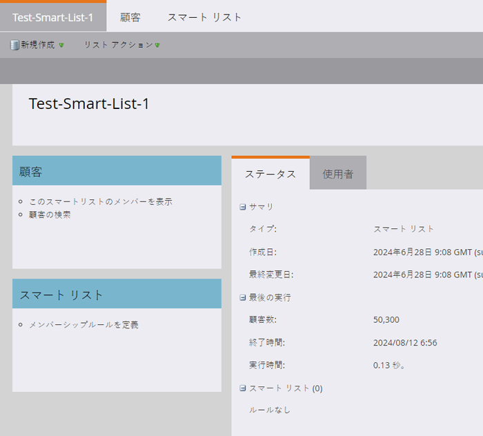
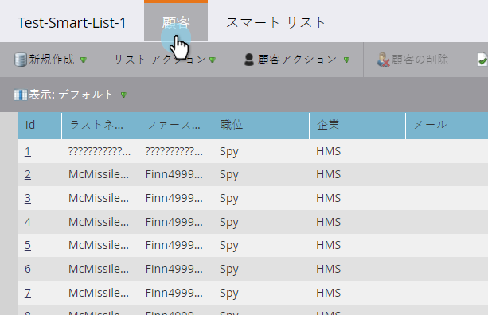
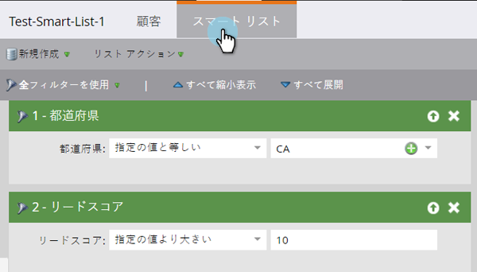

# スマートリストについて {#understanding-smart-lists}

スマートリストを使用すると、シンプルなフィルターで特定の人物のグループを見つけることができます。スマートリストは、スマートキャンペーン、プログラム、レポート、セグメント化、ビジネスモデル、エンゲージメントプログラム、動的コンテンツなど、Marketo のあらゆる部分で使用されています。必要に応じて、Marketo 内の 2 か所でスマートリストを作成できます。

1. **データベース**&#x200B;で、共有やグローバルで使用できる場合（「すべての登録解除済みのリード」など）。
1. **プログラム**&#x200B;にローカルアセットとして格納し、特定のプログラムに関連するリードのグループ（例：「トレードショー出席」）を検索します。

スマートリストを作成する主な手順は次のとおりです。

1. [スマートリストの作成](/help/marketo/product-docs/core-marketo-concepts/smart-lists-and-static-lists/creating-a-smart-list/create-a-smart-list.md){target="_blank"}
1. [フィルターを検索してスマートリストに追加](/help/marketo/product-docs/core-marketo-concepts/smart-lists-and-static-lists/creating-a-smart-list/find-and-add-filters-to-a-smart-list.md){target="_blank"}
1. [スマートリストフィルターの定義](/help/marketo/product-docs/core-marketo-concepts/smart-lists-and-static-lists/creating-a-smart-list/define-smart-list-filters.md){target="_blank"}

スマートリストの例は、次のとおりです。

## 「メイン」タブ {#main-tab}

[スマートリストの名前を編集](/help/marketo/product-docs/core-marketo-concepts/miscellaneous/rename-a-marketo-asset.md){target="_blank"}し、スマートリストの情報を確認できます。

## 「リード」タブ {#people-tab}

スマートリストの結果を閲覧できます。つまり、「スマートリスト」タブ内で[追加された定義](/help/marketo/product-docs/core-marketo-concepts/smart-lists-and-static-lists/creating-a-smart-list/find-and-add-filters-to-a-smart-list.md){target="_blank"}フィルターに該当するすべてのリードを確認できます。

## 「スマートリスト」タブ {#smart-list-tab}

フィルターを追加および定義して、「[!UICONTROL  ユーザー ] タブで特定のユーザーグループを表示します。

それでは、スマートリストを使ってみてください。

>[!MORELIKETHIS]
>
>* [ビルトイン／システムのスマートリストの使用](/help/marketo/product-docs/core-marketo-concepts/smart-lists-and-static-lists/using-smart-lists/use-built-in-system-smart-lists.md){target="_blank"}
>* [スマートリストの作成](/help/marketo/product-docs/core-marketo-concepts/smart-lists-and-static-lists/creating-a-smart-list/create-a-smart-list.md){target="_blank"}
