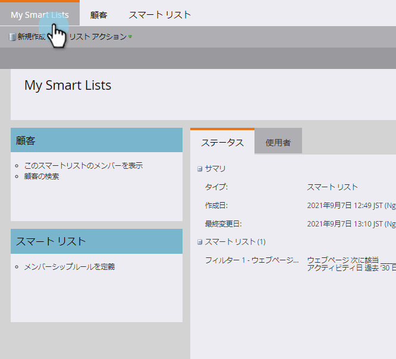
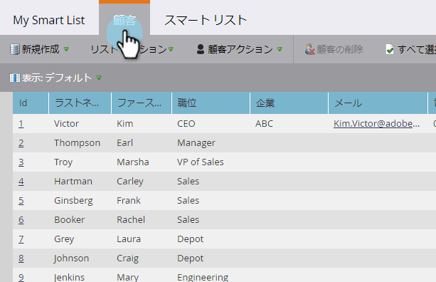
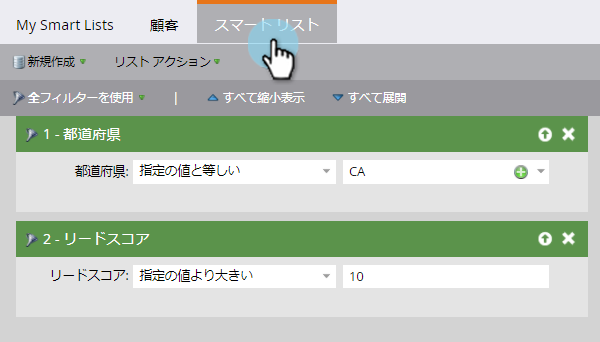

# スマートリストについて {#understanding-smart-lists}

スマートリストを使用すると、単純なフィルターを使用して特定のグループの人を検索できます。 スマートな [キャンペーン](http://docs.marketo.com/display/docs/smart+campaigns)、プログラム [、レポート、レポート、レポート、](http://docs.marketo.com/display/docs/programs)ビジネスモデル、エンゲージメント、エンゲージメント、エンゲージメント、動的な、動的なプログラムの上、エンゲージメント、動的なコンテンツ、動的なモデルの 上など、Marketoで使用されます。 ニーズに応じて、スマートリストはMarketor内の2か所で作成できます。

1. 共有/グローバルで使用できる **Database**（「All Unsubscribed People」など）。
1. **プログラム**をローカルアセットとして参照すると、そのプログラムに関連する人々のグループが見つかります（「出席商標」など）。

スマートリストを作成する主な手順は次のとおりです。

1. [スマートリストの作成](creating-a-smart-list/create-a-smart-list.md)
1. [スマート・リストの検索と追加フィルター](creating-a-smart-list/find-and-add-filters-to-a-smart-list.md)
1. [スマートリストフィルターの定義](creating-a-smart-list/define-smart-list-filters.md)

スマートリストの例を見てみましょう

## メインタブ {#main-tab}

ここでは、スマートリスト名を [編集し](../../../product-docs/core-marketo-concepts/miscellaneous/rename-a-marketo-asset.md) 、スマートリストに関する情報を確認できます。

## 「人」タブ {#people-tab}

ここに結果が表示されます。例えば、「スマートリスト」タブで [追加および定義したフィルターに該当するすべての人](creating-a-smart-list/find-and-add-filters-to-a-smart-list.md) 。

## スマートリストタブ {#smart-list-tab}

フィルターを追加および定義して、「人」タブで特定の人のグループを表示します。

よし始めよう！

>[!NOTE]
>
>**関連記事**
>
>* [組み込み/システムスマートリストの使用](using-smart-lists/use-built-in-system-smart-lists.md)
>* [スマートリストの作成](creating-a-smart-list/create-a-smart-list.md)

>

