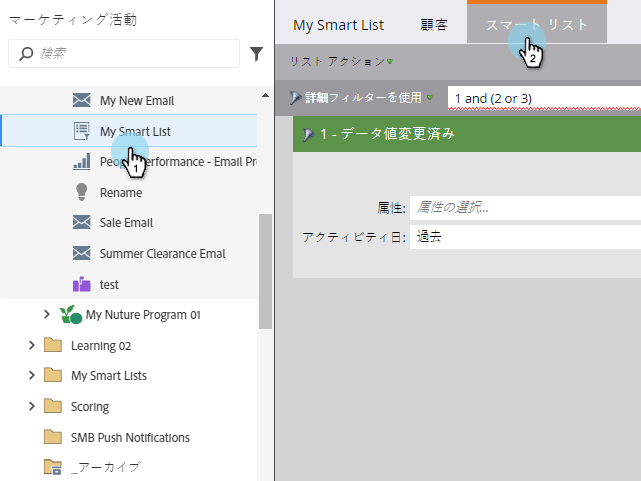
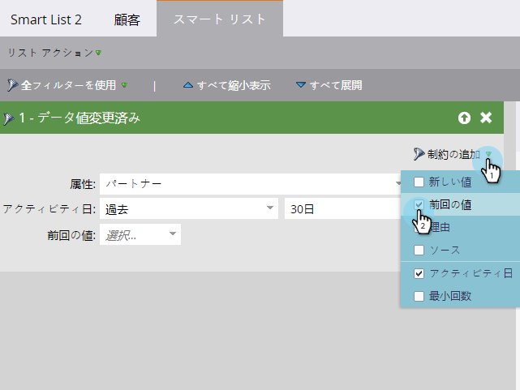
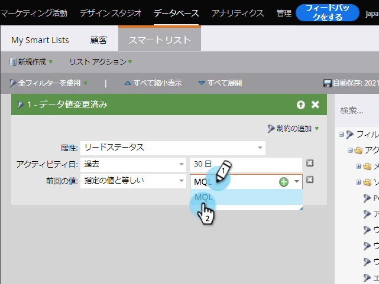
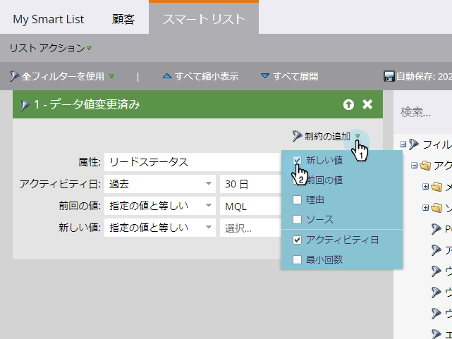
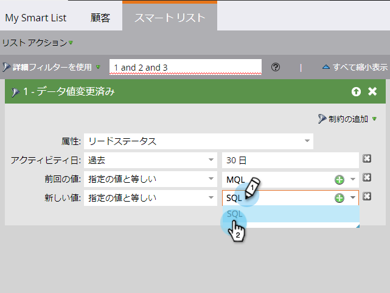

# スマ追加ートリストフィルターに対する制約{#add-a-constraint-to-a-smart-list-filter}

スマートリストを作成する場合、一部のフィルターには「制約」と呼ばれる高度なオプションがあります。 これらは、フィルターやトリガーに追加して、検索をさらに絞り込むための追加条件です。

この例では、**[Data Value Changed](/help/marketo/product-docs/core-marketo-concepts/smart-campaigns/flow-actions/change-data-value.md)**&#x200B;フィルターに制約を追加して、MQLからSQLにステータスが変化した人を探します。

>[!PREREQUISITES]
>
>* [スマートリストの作成](/help/marketo/product-docs/core-marketo-concepts/smart-lists-and-static-lists/creating-a-smart-list/create-a-smart-list.md)
>* [スマートリストでの「データ値の変更」フィルタの使用](/help/marketo/product-docs/core-marketo-concepts/smart-lists-and-static-lists/using-smart-lists/use-the-data-value-changed-filter-in-a-smart-list.md)

>

1. **マーケティングアクティビティ**&#x200B;に移動します。

   

1. 制約を追加するフィルターを持つスマートリストを選択し、「**スマートリスト**」タブをクリックします。

   

1. 「**追加制約**」で、「**以前の値**」を選択します。

   

1. **以前の値**&#x200B;を入力します。 この例では、MQLを使用しています。

   

1. 「**追加制約**」で、「**新しい値**」を選択します。

   

1. **新しい値**&#x200B;を入力します。 この例では、SQLを使用しています。

   

1. うまくいった！ 「**ユーザー**」タブをクリックすると、過去30日間に&#x200B;**ステータス**&#x200B;が&#x200B;**MQL**&#x200B;から&#x200B;**SQL**&#x200B;に変更されたすべてのユーザーが表示されます。
