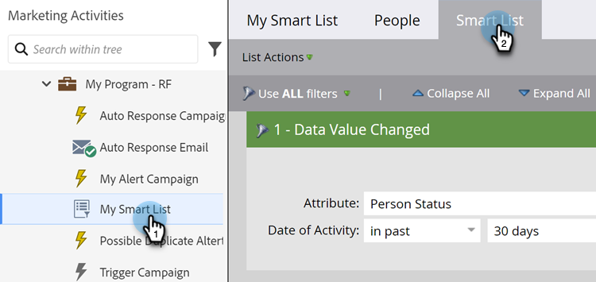
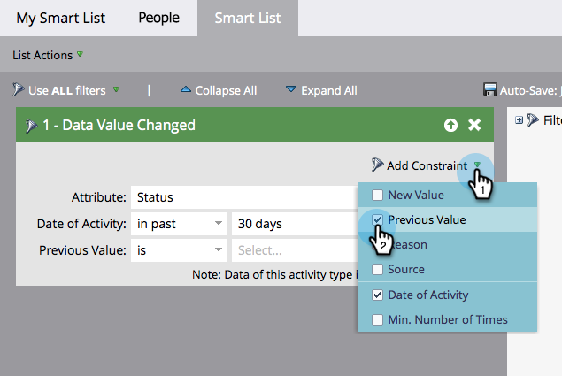
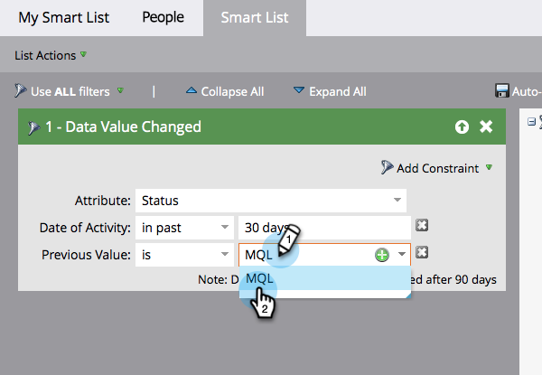

# スマートリストフィルターへの制約の追加 {#add-a-constraint-to-a-smart-list-filter}

スマートリストを作成する際にフィルターの一部には、「制約」と呼ばれる高度なオプションが含まれています。 制約を利用してフィルターやトリガーにさらなる条件を追加することで、検索をさらに絞り込むことができます。

この例では、MQLからSQLにステータスが変更されたユーザーを検索するために、**[データ値が変更された](/help/marketo/product-docs/core-marketo-concepts/smart-campaigns/flow-actions/change-data-value.md){target="_blank"}** フィルターに一部の制約を追加します。

>[!PREREQUISITES]
>
>* [スマートリストの作成](/help/marketo/product-docs/core-marketo-concepts/smart-lists-and-static-lists/creating-a-smart-list/create-a-smart-list.md){target="_blank"}
>* [スマートリストで「データ値変更済み」フィルターを使用します。](/help/marketo/product-docs/core-marketo-concepts/smart-lists-and-static-lists/using-smart-lists/use-the-data-value-changed-filter-in-a-smart-list.md){target="_blank"}

1. **[!UICONTROL マーケティングアクティビティ]**&#x200B;に移動します。

   

1. 制約を追加するフィルターが設定されているスマートリストを選択して、「**[!UICONTROL スマートリスト]**」タブをクリックします。

   

1. 「**[!UICONTROL 制約を追加]**」から「**[!UICONTROL 前回の値]**」を選択します。

   

1. 「**[!UICONTROL 前回の値]**」に入力します。 この例では、MQL を使用します。

   

1. 「**[!UICONTROL 制約を追加]**」から「**[!UICONTROL 新しい値]**」を選択します。

   

1. 新しい値を入力します。 この例では、SQL を使用します。

   

1. 「**[!UICONTROL 人物]**」タブをクリックすると、過去 30 日間にステータスが「MQL」から「SQL」に変わったすべての対象者が表示されます。
