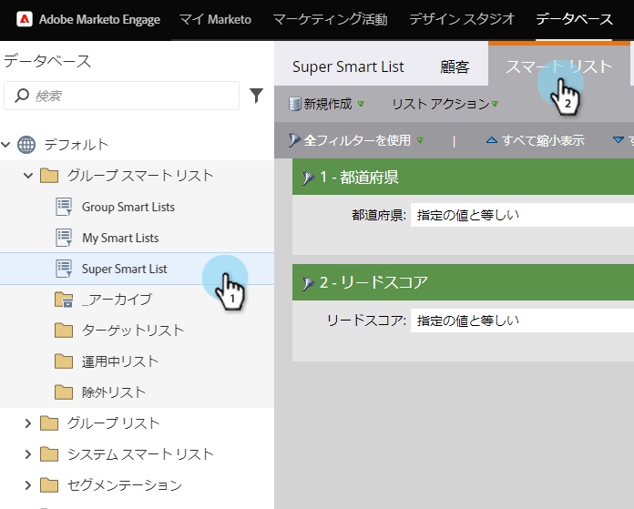
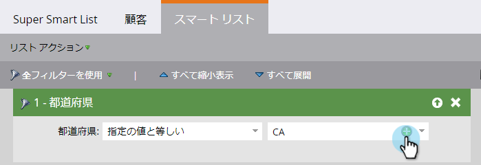
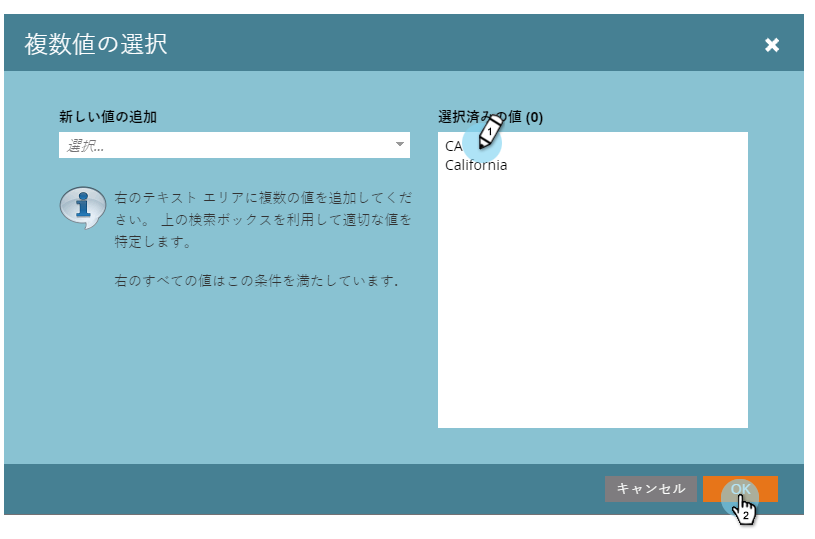

# ス追加マート・リスト・フィルタへの複数値 {#add-multiple-values-to-a-smart-list-filter}

>[!PREREQUISITES]
>
>* [スマートリストの作成](../../../../product-docs/core-marketo-concepts/smart-lists-and-static-lists/creating-a-smart-list/create-a-smart-list.md)
>* [スマート・リストの検索と追加フィルター](../../../../product-docs/core-marketo-concepts/smart-lists-and-static-lists/creating-a-smart-list/find-and-add-filters-to-a-smart-list.md)

>

カリフォルニアの全員を見つけたいとしますが、 **カリフォルニア** と **** CAの両方をデータベースに格納しているとします。 該当するすべてのユーザーを含めるには、2つの **州** フィルターを使用できますが、1つの州を使用すると簡単です。

1. 「 **マーケティングアクティビティ**」に移動します。

   

1. スマートリストを検索して選択し、「 **スマートリスト** 」タブをクリックします。

   

1. フィルターの **プラス記号** (+)をクリックします。

   

1. 左側の値を選択するか、右側の値を入力して「 **OK**」をクリックします。

   

   早く！

>[!NOTE]
>
>**関連記事**
>
>* [スマートリストフィルター追加の制約](add-a-constraint-to-a-smart-list-filter.md)
>* [スマートリストでの高度なフィルターの使用](using-advanced-smart-list-rule-logic.md)

>

