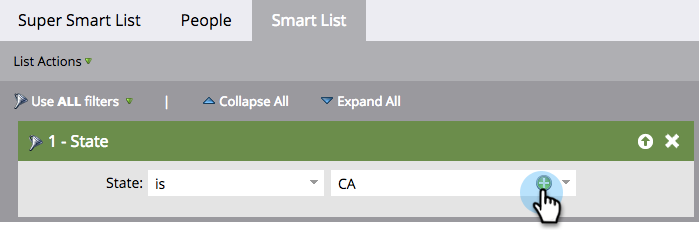

# スマートリストフィルターへの複数値の追加 {#add-multiple-values-to-a-smart-list-filter}

>[!PREREQUISITES]
>
>* [スマートリストの作成](/help/marketo/product-docs/core-marketo-concepts/smart-lists-and-static-lists/creating-a-smart-list/create-a-smart-list.md){target="_blank"}
>* [フィルターを検索してスマートリストに追加](/help/marketo/product-docs/core-marketo-concepts/smart-lists-and-static-lists/creating-a-smart-list/find-and-add-filters-to-a-smart-list.md){target="_blank"}

例えば、カリフォルニア州のすべてのユーザーを検索する場合、データベースに「California」と「CA」の両方を保存している可能性があります。 該当するすべてのユーザーを含めるには、2つの[!UICONTROL 状態] フィルターを使用できますが、1つのフィルターを使用すると簡単になります。

1. **[!UICONTROL マーケティングアクティビティ]**&#x200B;に移動します。

   

1. スマートリストを検索して選択し、「**[!UICONTROL スマートリスト]**」タブをクリックします。

   

1. 「**+**」をクリックします。

   

1. 左側から値を選択するか、右側に値を入力して、**[!UICONTROL OK]**&#x200B;をクリックします。

   

>[!MORELIKETHIS]
>
>* [スマートリストフィルターへの制約の追加](/help/marketo/product-docs/core-marketo-concepts/smart-lists-and-static-lists/using-smart-lists/add-a-constraint-to-a-smart-list-filter.md){target="_blank"}
>* [スマートリストでの詳細フィルターの使用](/help/marketo/product-docs/core-marketo-concepts/smart-lists-and-static-lists/using-smart-lists/using-advanced-smart-list-rule-logic.md){target="_blank"}
