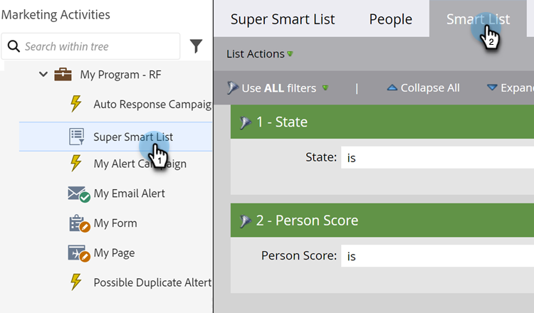
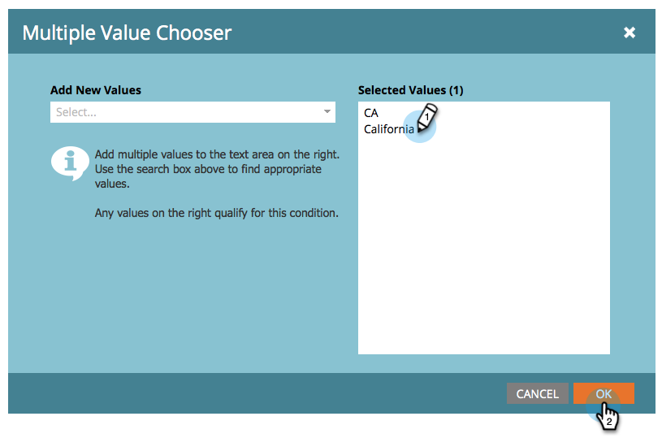

# スマートリストフィルターへの複数値の追加 {#add-multiple-values-to-a-smart-list-filter}

>[!PREREQUISITES]
>
>* [スマートリストの作成](/help/marketo/product-docs/core-marketo-concepts/smart-lists-and-static-lists/creating-a-smart-list/create-a-smart-list.md){target="_blank"}
>* [フィルターを検索してスマートリストに追加](/help/marketo/product-docs/core-marketo-concepts/smart-lists-and-static-lists/creating-a-smart-list/find-and-add-filters-to-a-smart-list.md){target="_blank"}

カリフォルニア州在住のすべての人を検索する際に、「California」および「CA」の両方がデータベースに保存されている可能性があるとします。該当するすべての人物を含めるには、2 つの[!UICONTROL 州]フィルターを使用することもできますが、1 つのフィルターを使用する方が簡単です。

1. 「**[!UICONTROL マーケティング活動]**」に移動します。

   

1. スマートリストを検索して選択し、「**[!UICONTROL スマートリスト]**」タブをクリックします。

   

1. 「**+**」をクリックします。

   

1. 左から値を選択するか、右に値を入力して「**[!UICONTROL OK]**」をクリックします。

   

これで完了です。

>[!MORELIKETHIS]
>
>* [スマートリストフィルターへの制約の追加](/help/marketo/product-docs/core-marketo-concepts/smart-lists-and-static-lists/using-smart-lists/add-a-constraint-to-a-smart-list-filter.md){target="_blank"}
>* [スマートリストでの詳細フィルターの使用](/help/marketo/product-docs/core-marketo-concepts/smart-lists-and-static-lists/using-smart-lists/using-advanced-smart-list-rule-logic.md){target="_blank"}
