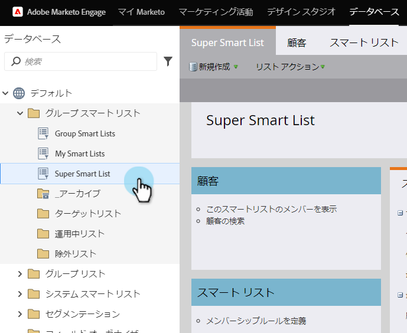
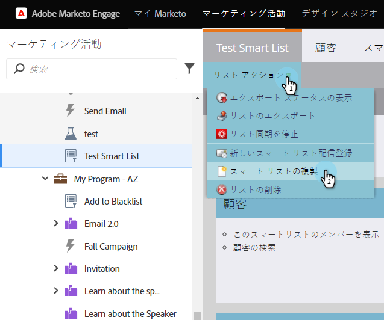
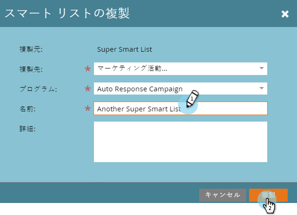

# リストまたはスマートリストのコピー {#clone-a-list-or-smart-list}

スマートリストを一から作成する代わりに、同様の画像をコピーして変更を加えることで、時間を節約できます。 これが方法です。

1. 「 **マーケティングアクティビティ**」に移動します。

   

1. コピーするスマートリストを選択します。

   

1. 「 **リストの操作**」で、「スマートリストを **コピー**」をクリックします。

   

1. **名前を入力し** 、「 **クローン**」をクリックします。

   

いい仕事！ 同様に、正規リストをコピーすることもできます。
