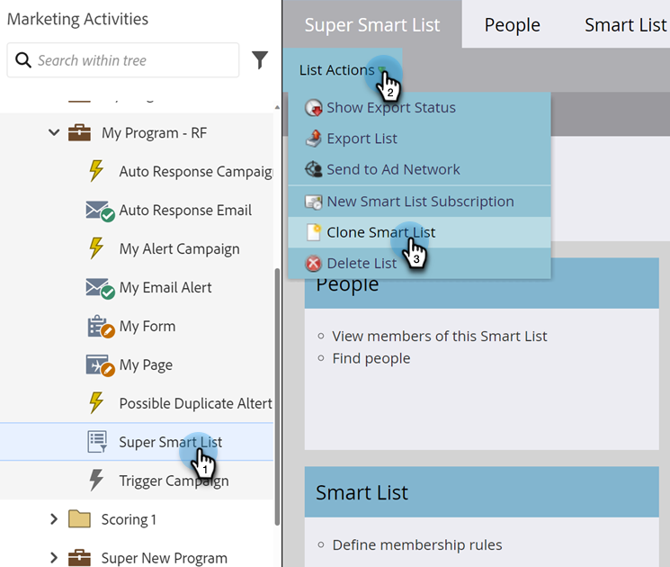

# リストまたはスマートリストの複製 {#clone-a-list-or-smart-list}

新規のスマートリストを最初から作成する代わりに、既存のリストを複製し、内容を変更して使用することで、時間を節約できます。

1. **[!UICONTROL マーケティングアクティビティ]**&#x200B;に移動します。

   

1. 複製するスマートリストを選択します。 「**[!UICONTROL リストアクション]**」で「**[!UICONTROL スマートリストの複製]**」をクリックします。

   

1. **[!UICONTROL 名前]**&#x200B;を入力して「**[!UICONTROL 複製]**」をクリックします。

   

通常のリストも同じ方法で複製できます。
