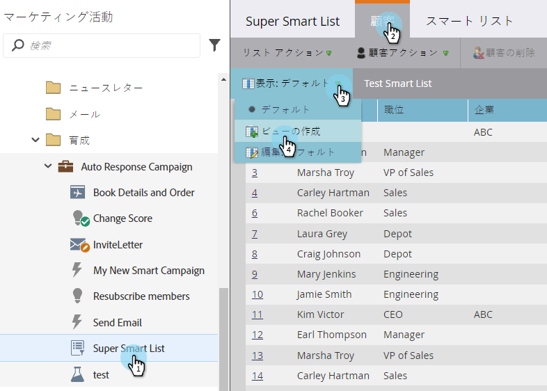
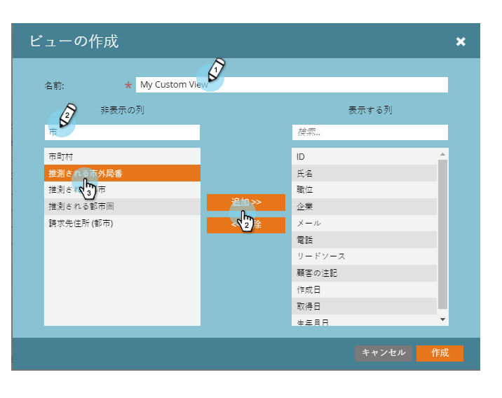
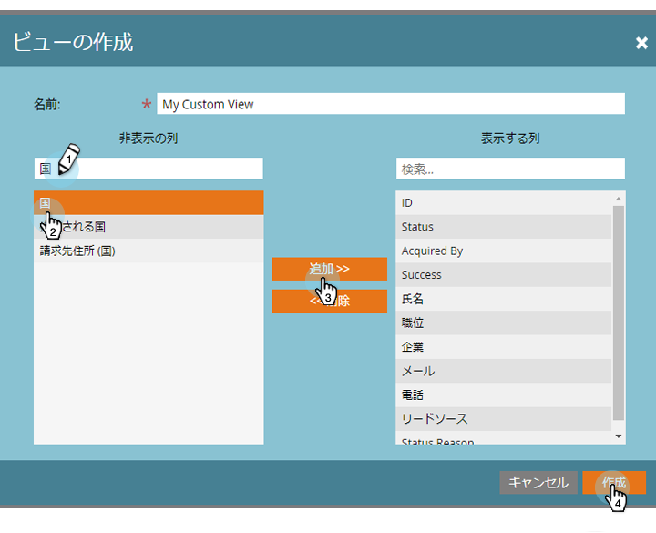
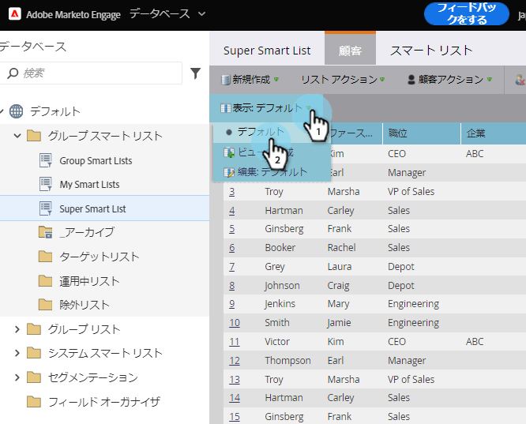
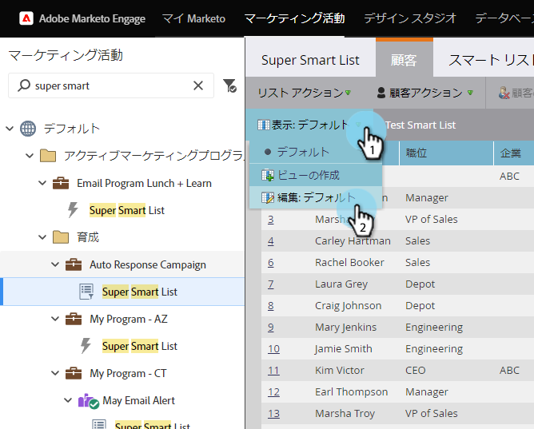
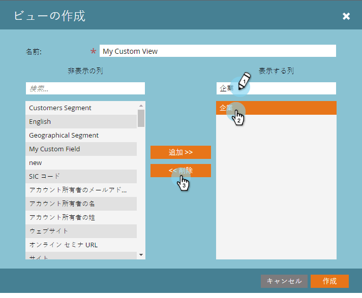
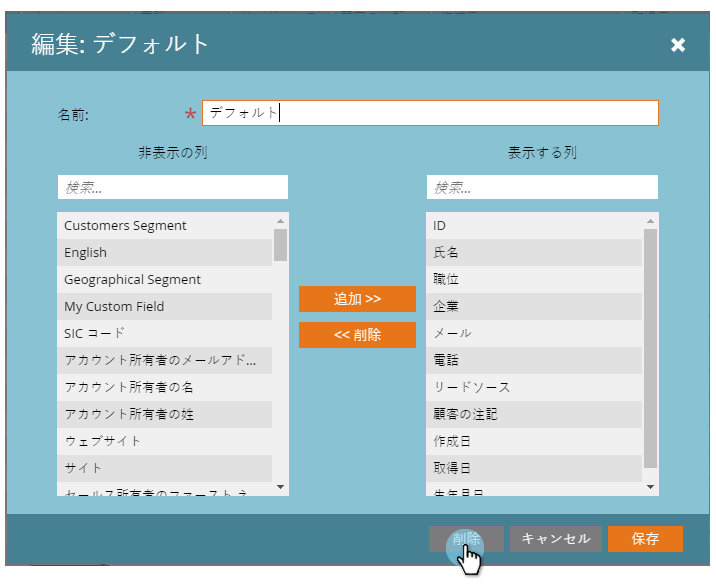

# リストとスマートリストの表示の作成と変更 {#create-and-change-views-for-lists-and-smart-list}

スマートリストには、デフォルトの列セットが表示されます。 心の中に収まるように編集できるのを知ってた？ これが方法です。

## 表示の作成 {#create-a-view}

1. リストまたはスマートリストに移動し、「 **人** 」タブをクリックし、「 **** 表示」ドロップダウンの下にある「 **表示を作成****** 」をクリックします。
1. 

1. 表示に名前を付け、追加または削除する列を探します。

   

   目的の追加列を削除し、「作成」をクリックします。

   

>[!TIP]
>
>すばやく検索するには、「 **検索** 」ボックスを使用します。

## 表示の切り替え {#switch-views}

1. 「 **表示** 」ドロップダウンをクリックし、目的の表示を選択します。 必要に応じて、表示を切り替えます。

   

>[!NOTE]
>
> 表示を切り替えるには、デフォルトの表示に加えて、最初に2つ目の表示を作成する必要があります。

## 表示の編集 {#edit-a-view}

1. 「 **表示** 」ドロップダウンで、編集する表示が選択されていることを確認します。

   

1. 「 **編集** 」オプションをクリックします。

   

1. 必要な変更を行い、「 **保存**」をクリックします。

   

## 表示の削除 {#delete-a-view}

1. 削除する表示の「 **編集** 」オプションを **表示** ドロップダウンから選択します。

   

1. 「 **削除**」をクリックします。

   

作成したカスタム表示は[表示]ドロップダウンリストに表示されるので、友達に自分で作成する必要があると伝えます。

>[!NOTE]
>
>**関連記事**
>
>* [組み込み/システムスマートリストの使用](use-built-in-system-smart-lists.md)
>* [スマートリストの作成](../../../../product-docs/core-marketo-concepts/smart-lists-and-static-lists/creating-a-smart-list/create-a-smart-list.md)

>

