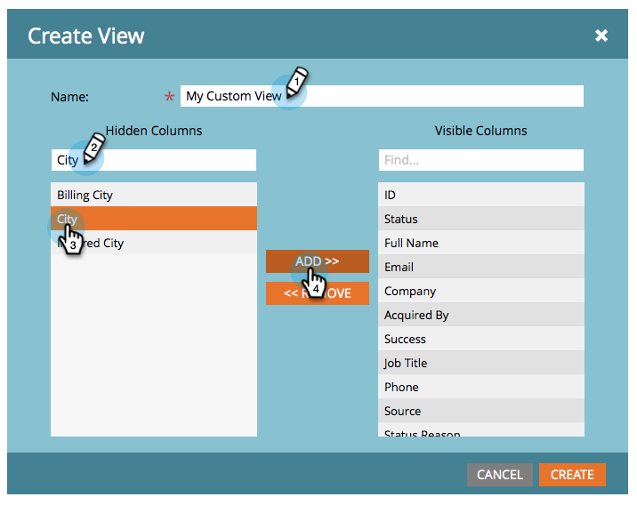

# リストおよびスマートリストのビューの作成と変更 {#create-and-change-views-for-lists-and-smart-list}

スマートリストには、デフォルトの列セットが表示されます。列は自由に編集できるのをご存知でしたか？手順は次のとおりです。

## ビューを作成する {#create-a-view}

1. リストまたはスマートリストに移動し、「**[!UICONTROL 人物]**」タブで、「**[!UICONTROL 表示]**」ドロップダウンリストから「**[!UICONTROL ビューを作成]**」をクリックします。

   

1. ビューに名前を付け、追加または削除する列を見つけます。

   

1. 目的の列を追加または削除して、「**[!UICONTROL 作成]**」をクリックします。

   

>[!TIP]
>
>素早く検索するには、「**[!UICONTROL 検索]**」ボックスを使用します。

## ビューを切り替える {#switch-views}

1. 「**[!UICONTROL 表示]**」ドロップダウンから、目的のビューを選択します。必要に応じて、ビュー間を切り替えます。

   

>[!NOTE]
>
> ビューを切り替えるには、既定のビューに加えて、2 番目のビューを作成する必要があります。

## ビューを編集する {#edit-a-view}

1. 編集するビューが「**[!UICONTROL 表示]**」ドロップダウンリストから選択できることを確認してください。

   

1. 「**[!UICONTROL 編集]**」オプションをクリックします。

   

1. 必要な変更を行い、「**[!UICONTROL 保存]**」をクリックします。

   

## ビューを削除する {#delete-a-view}

1. 「**[!UICONTROL 表示]**」ドロップダウンリストから削除するビューの「**[!UICONTROL 編集]**」オプションを選択します。

   

1. 「**[!UICONTROL 削除]**」をクリックします。

   

作成したカスタムビューは、作成したユーザーの「表示」ドロップダウンのみに表示されるので、自分自身でビューを作成する必要があります。

>[!MORELIKETHIS]
>
>* [ビルトイン／システムのスマートリストの使用](/help/marketo/product-docs/core-marketo-concepts/smart-lists-and-static-lists/using-smart-lists/use-built-in-system-smart-lists.md){target="_blank"}
>* [スマートリストの作成](/help/marketo/product-docs/core-marketo-concepts/smart-lists-and-static-lists/creating-a-smart-list/create-a-smart-list.md){target="_blank"}
