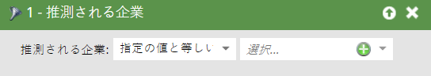
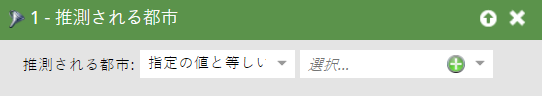
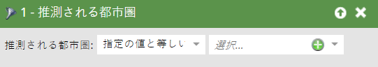
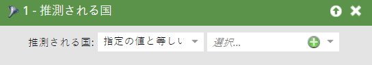

# 推定フィルター{#inferred-filters}

誰かが貴社のウェブサイトを訪れた時、[Munchkin](../../../../product-docs/administration/additional-integrations/add-munchkin-tracking-code-to-your-website.md)はCookieを作り、システムに入れます。 IPを特別なデータベースで調べ、あらゆる良い情報を推測します。 見て。

スマートリストでこれらのフィルターのいずれかを使用すると、その結果、推定された情報を持つ人々が生成されます。

>[!TIP]
>
>これらのフィルターは、Webアクティビティレポートで使用します。 販売担当者の担当地域を使用し、過去24時間のWebサイト訪問者を含むカスタム日次レポートに登録します。 彼らはそれを愛する！
>
>* 訪問済みWebページ — 過去24時間
>* 推定状態は[自分の領土]を選択します

>

これらの匿名訪問者は、電子メールリンクをクリックしたりフォームに入力したりすると、自動的に人に変換されます。 ただし、推測された情報はすべて保持されます。

>[!NOTE]
>
>**ディープダイブ**
>
>[匿名アクティビティとリード](../../../../product-docs/core-marketo-concepts/smart-lists-and-static-lists/managing-people-in-smart-lists/understanding-anonymous-activity-and-people.md)の詳細を確認します。

