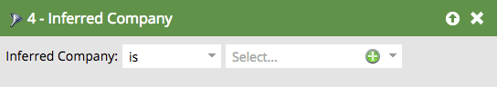
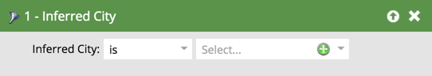
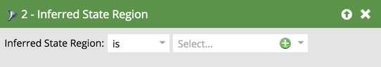
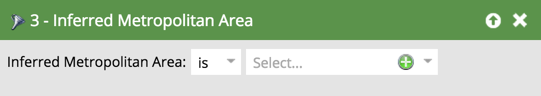
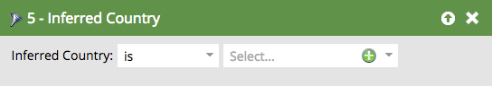
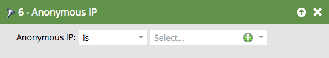

# 推測フィルター {#inferred-filters}

web サイトの訪問者には、[Munchkin](/help/marketo/product-docs/administration/additional-integrations/add-munchkin-tracking-code-to-your-website.md){target="_blank"} Cookie が作成され、システムに格納されます。 システムは特別なデータベースでIPを検索し、あらゆる種類の情報を推測します。

>[!NOTE]
>
>推定フィールド値を最新の状態に保つために、IP アドレス検索に使用されるデータベースは定期的に更新されます。 データベースの更新によって新しい推測フィールド値が追加されることがあり、それらをスマートリストのフィルター定義に追加する必要が生じる場合があります。
>
>データベースの更新は、[Marketo Engage 製品のリリース](/help/marketo/release-notes/release-schedule.md){target="_blank"}中に行われる場合があります。 更新が行われると、[Marketo Engage リリースノート](/help/marketo/release-notes/current.md){target="_blank"}に、推測されるフィールド値の変更に関する説明が含まれます。

スマートリストでこれらのフィルターのいずれかを使用すると、推測される情報を持つ人物が表示されます。

>[!TIP]
>
>これらのフィルターを web アクティビティレポートで使用します。 セールス担当の担当地域を使用して、過去 24 時間以内の web サイト訪問者を含むカスタム日次レポートに登録します。 きっと気に入ることでしょう。
>
>* Web ページを訪問 - 過去 24 時間
>* 推測される都道府県／地域に、[担当地域を選択]します。

匿名の訪問者は、メールリンクをクリックしたりフォームに入力したりすると、自動的に人物に変換されます。 ただし、推測される情報はすべて保持されます。

>[!NOTE]
>
>詳しくは、[匿名のアクティビティとリード](/help/marketo/product-docs/core-marketo-concepts/smart-lists-and-static-lists/managing-people-in-smart-lists/understanding-anonymous-activity-and-people.md){target="_blank"}を参照してください。
