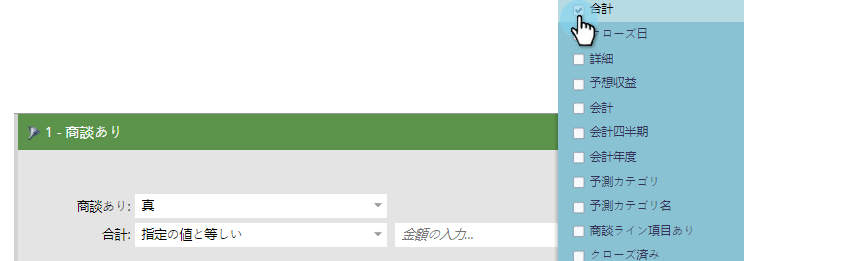
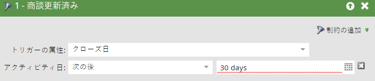
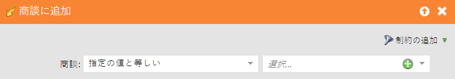
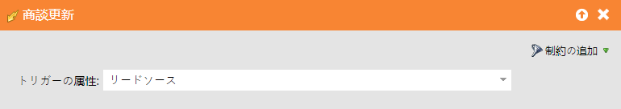

# オポチュニティのフィルターとトリガー{#opportunity-filters-and-triggers}

オポチュニティのフィルターとトリガーを使用すると、Salesforceからオポチュニティイベントを追跡できます。 他のフィルターやトリガーと比べて少し違う。

## オポチュニティフィルター{#opportunity-filters}

オポチュニティのフィルターを使用すると、Salesforceのリードを掘り下げて、オポチュニティを得ることができます。 スマートリストの編集時に、パレットのOpportunitiesフォルダーにあります。 味が少ない。

* オプション数
* 合計金額
* 合計利益予測売上高
* オポチュニティがある
* オポチュニティが追加されました
* オポチュニティが削除されました
* オポチュニティが更新されました

オポチュニティフィールド（カスタムまたは標準）を探している場合は、「**オポチュニティ**&#x200B;を持つ」フィルターを使用するか、「**オポチュニティは`[Added/Removed/Updated]`**&#x200B;フィルターまたはトリガーでした」を使用します。

**オプション数、合計オプティ数、合計オプティ予想売上高**

これらのフィルターを使用すると、すべてのオポチュニティの合計数、金額、または予想売上高に基づいてリードを見つけることができます。

**オポチュニティがオポチュニティに追加され、オポチュニティから削除された**

条件の組み合わせに基づいてオポチュニティを持つリードを探している場合は、「**オポチュニティ**&#x200B;を持っています」、「**Was Added to Opportunity**」、または「**Was Removed from Opportunity**」フィルタを使用します。 彼らは言う：

* **オポチュニティがある**:このリードに現在、一致するオポチュニティがある場合
* **Opportunityに追加されました**:このリードが一致するオポチュニティに追加された場合
* **Opportunityから削除されました**:このリードが一致するオポチュニティから削除された場合

フィルター追加の&#x200B;**制約**&#x200B;として検索条件を指定します。 制約には、オポチュニティの標準フィールドとカスタムフィールドが含まれます。

例えば、少なくとも5,000ドルのオープンオポチュニティを持つリードを検索するとします。 **Has Opportunity**&#x200B;フィルターをドラッグし、**Is Closed**&#x200B;および&#x200B;**Amount**&#x200B;制約を使用します。

>[!NOTE]
>
>複数のオポチュニティフィルターを使用すると、誤った回答が得られる場合があります。 上記の例を2つのOpportunityフィルターを使用して作成した場合、たとえそれぞれ別のオポチュニティであっても、$5,000以上のオポチュニティを持つリードと、閉じた任意のオポチュニティのリストが得られます。

**オポチュニティが更新されました**

**Opportunity was Updated**&#x200B;フィルターは、特定のオポチュニティフィールドが更新されたときに、任意のオポチュニティを探します。 [トリガー属性]プルダウンでチェックするフィールドを選択し、拘束を使用して変更のセットを絞り込みます。

例えば、このフィルターを使用すると、直近30日間に終了日が変更されたすべてのリードが表示されます。

## オポチュニティトリガー{#opportunity-triggers}

次のオポチュニティトリガーを使用できます。 これらは、イベントが発生したときにキャンペーンをトリガーできる点を除いて、対応するフィルター（前述）と同様に機能します。

* オポチュニティが更新されました
* オポチュニティに追加
* オポチュニティから削除

例えば、任意のオポチュニティにリードが追加された場合に、このスマートリストをトリガーに使用できます。 フローでは、それらをMarketing Suspendedリストに追加したり、ターゲットを絞った電子メールを送信したりできます。

オポチュニティのカスタムフィールドをトリガーするには、**Opportunity is Updated**&#x200B;トリガーを使用し、プルダウンでフィールドを選択します。

