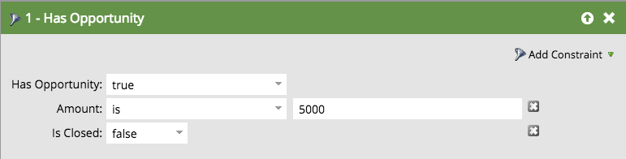

# 商談フィルターおよびトリガー {#opportunity-filters-and-triggers}

商談のフィルターとトリガーを使用すると、[!DNL Salesforce] から商談イベントをトラッキングできます。 他のフィルターおよびトリガーとは少し異なります。

## 商談フィルター {#opportunity-filters}

商談フィルターを使うと、Salesforce で商談があるリードに絞り込むことができます。商談フィルターは、スマートリストを編集するときの「パレット」の「商談」フォルダーにあります。いくつかの種類があります。

* 商談数
* 合計商談数
* 商談の合計収益予測
* 商談あり
* 商談に追加済み
* 商談から削除済み
* 商談は更新済み

商談のフィールド（カスタムまたは標準）を探す場合は&#x200B;**商談あり**&#x200B;フィルター、または&#x200B;**商談`[Added/Removed/Updated]`**&#x200B;フィルターまたはトリガーを使用します。

**商談数、合計商談数、商談の合計売上高予測**

これらのフィルターを使用すると、それぞれ商談数、合計の商談数、または商談の売上高予測に基づいてリードを検索できます。

**商談あり、商談に追加済み、商談から削除済み**

基準の組み合わせに基づいて商談のあるリードを探す場合は、**商談あり**、**商談に追加済み**、**商談から削除済み**&#x200B;のフィルターを使用します。意味は以下のとおりです。

* **商談あり**：このリードに現在、一致する商談があるかどうか
* **商談に追加済み**：このリードが、一致する商談に追加されたかどうか
* **商談から削除済み**：このリードが、一致する商談から削除されたかどうか

フィルターに対する&#x200B;**制約**&#x200B;として検索基準を追加します。制約には、商談の標準およびカスタムフィールドが含まれます。

例えば、5,000 ドル以上の進行中の商談があるリードを探したい場合、**商談あり**&#x200B;フィルターをドラッグし、**クローズ済み**&#x200B;制約と&#x200B;**金額**&#x200B;制約を使用します。

>[!NOTE]
>
>複数の商談フィルターを使用すると、正しい結果が得られない可能性があります。上の例で 2 つの商談フィルターを使用すると、たとえ別々の商談だとしても、5,000 ドル以上のいずれかの商談と、クローズされたいずれかの商談を持つリードのリストが返されます。

**商談は更新済み**

**商談は更新済み**&#x200B;フィルターは、特定の商談フィールドが更新された商談を検索します。フィールドを選択して「トリガーの属性」プルダウンを確認してから、制約を使用して変更のセットを絞り込みます。

例えば、次のフィルターでは、過去 30 日以内にクローズ日が変更されたリードがすべて表示されます。

## 商談トリガー {#opportunity-triggers}

以下の商談トリガーを使用できます。これは商談フィルター（上述）とまったく同じように機能しますが、イベントが発生したときにキャンペーンをトリガーできる点が異なります。

* 商談更新
* 商談に追加
* 商談から削除

例えば、このスマートリストを使用して、任意のリードが商談に追加されたときにトリガーすることができます。そしてフローで、「マーケティングを中断したリード」リストに追加するか、ターゲットを絞ったメールを送信することができます。

商談のカスタムフィールドでトリガーする場合は、**商談更新**&#x200B;トリガーを使用し、プルダウンでフィールドを選択してください。

