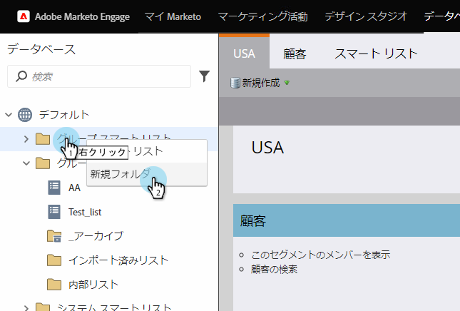
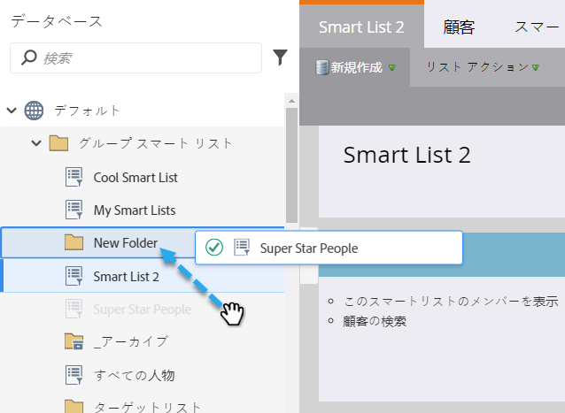
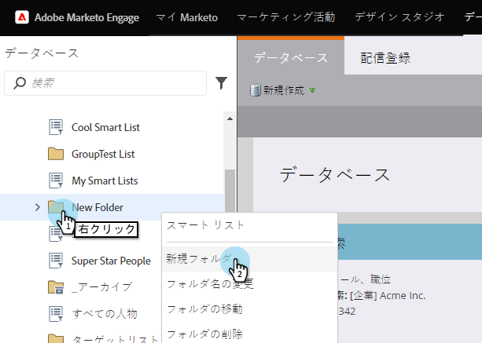

# Workspace間でのリストまたはスマートリストの参照 {#reference-a-list-or-smart-list-across-workspaces}

リストとスマートリストは、複数のワークスペースで共有および参照でき、データベースから簡単に再利用できます。

>[!NOTE]
>
>個人パーティションルールが適用されます(ワークスペース内のスマートリストと静的リストには、リストのメンバー *と* 、現在のワークスペースのメンバーの両方であるユーザーのみが表示されます)。

## リストまたはスマートリストの共有  {#share-a-list-or-smart-list}

1. データ **ベースに移動します**。

   

1. キャンペーンフォルダーを右クリックします。 「 **新規フォルダ**」を選択します。

   >[!NOTE]
   >
   >アセットがフォルダー内にネストされている場合は、アセットをワークスペース間でのみ共有できます。

   

1. 共有するリストまたはスマートリストを新しいフォルダーにドラッグ&amp;ドロップします。

   

1. 「 **New Folder** 」を右クリックし、「 **Share Folder**」を選択します。

   

1. 共有する**Workspace **を選択します。 「 **保存**」を選択します。

   

   すごい！ このリストは、両方のワークスペースで使用できるようになります。

   >[!NOTE]
   >
   >マーケティングアクティビティでは、最上位レベルのフォルダーのみを共有できます。 データベースでは、最上位レベルのフォルダーと、1つ下のレベルのフォルダーを共有できます。

