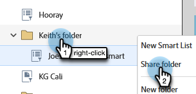

# 複数のワークスペースをまたいだリストやスマートリストの参照 {#reference-a-list-or-smart-list-across-workspaces}

リストとスマートリストは、データベースから簡単に再利用できるように、複数のワークスペースをまたいで共有および参照できます。

>[!NOTE]
>
>人物パーティションルールが適用されます（ワークスペースのスマートリストと静的リストは、リスト&#x200B;_および_&#x200B;現在のワークスペースの両方のメンバーのみを表示します）。

## リストまたはスマートリストを共有する {#share-a-list-or-smart-list}

1. 「**[!UICONTROL データベース]**」に移動します。

   

1. キャンペーンフォルダーを右クリックします。「**[!UICONTROL 新規フォルダー]**」を選択します。

   

   >[!NOTE]
   >
   >アセットがフォルダーにネストされている場合、アセットは複数のワークスペース間でのみ共有できます。

1. フォルダーに名前を付け、「**[!UICONTROL 作成]**」をクリックします。

   

1. 共有するリストまたはスマートリストを新しいフォルダーにドラッグ＆ドロップします。

   

1. 新しいフォルダーを右クリックし、「**[!UICONTROL フォルダーを共有]**」を選択します。

   

1. 共有する&#x200B;**[!UICONTROL ワークスペース]**&#x200B;を選択し、「**[!UICONTROL 保存]**」をクリックします。

   

   これで完了です。リストが両方のワークスペースで使用できるようになりました。

   >[!NOTE]
   >
   >マーケティング活動では、共有できるのはトップレベルのフォルダーのみです。データベースでは、最上位フォルダーと 1 つ下のフォルダーを共有できます。
