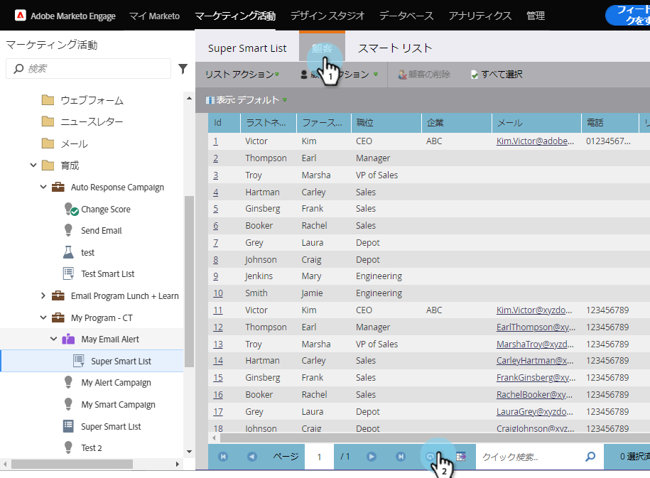

# リストまたはスマートリストの更新 {#refresh-a-list-or-smart-list}

>[!NOTE]
>
>**FYI**
>
>Marketoは現在、すべての購読で言語を標準化しているので、購読およびdocs.marketo.comの人物/人物にリード/リードを表示できます。 これらの用語は同じことを意味し、記事の説明には影響しません。 他にも変化がある。 [詳細情報](http://docs.marketo.com/display/DOCS/Updates+to+Marketo+Terminology)。

スマートリストを実行してから数分が経過した場合は、結果が今は異なる場合があります。更新して確認してください。

## 結果を更新 {#refresh-results}

1. スマートリストの「 **人** 」タブのデータを更新するには、更新アイコンをクリックします。

   

1. スマートリストが再実行され、より最新の結果セットが表示されます。

   

>[!TIP]
>
>スマートリストを実行して後で戻ってきたときに、右下隅の人数の前に「説明」という単語が表示されることがあります。 これは、数がおおよその数であることを示しています。数自体をクリックして更新し、更新された正確な数を取得します。

>[!NOTE]
>
>**関連記事**
>
>* [リストまたはスマートリストからExcelにユーザーをエクスポート](../../../../product-docs/core-marketo-concepts/smart-lists-and-static-lists/managing-people-in-smart-lists/export-people-to-excel-from-a-list-or-smart-list.md)

>

