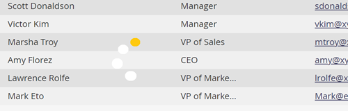

# リストまたはスマートリストの更新 {#refresh-a-list-or-smart-list}

スマートリストを実行してから数分が経過している場合、結果が変わっている可能性があるため、更新して確認します。

## 結果を更新 {#refresh-results}

1. スマートリストの「**[!UICONTROL 人物]**」タブで、データを更新するには、更新アイコンをクリックします。

   

1. スマートリストが再実行され、より新しい結果が表示されます。

   

>[!TIP]
>
>スマートリストを実行し、後で再び表示すると、右下の人数の前に「約」と表示されていることがあります。数はおおよその数であり、数を更新して正確な数を表示するには、数値自体をクリックします。

>[!MORELIKETHIS]
>
>[リストまたはスマートリストから人物を Excel にエクスポート](/help/marketo/product-docs/core-marketo-concepts/smart-lists-and-static-lists/managing-people-in-smart-lists/export-people-to-excel-from-a-list-or-smart-list.md){target="_blank"}
