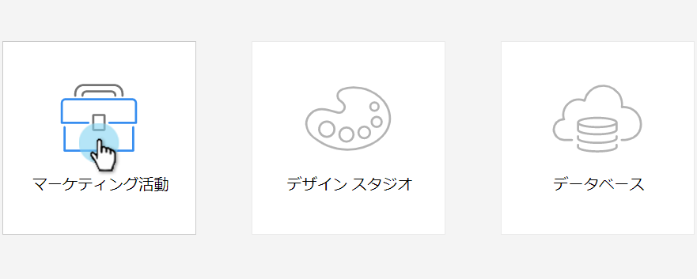
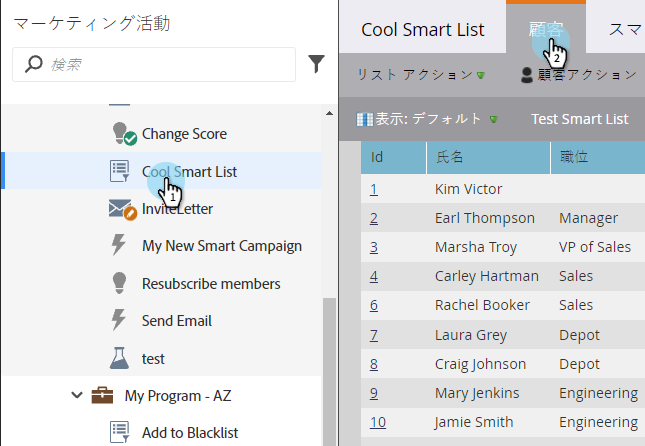
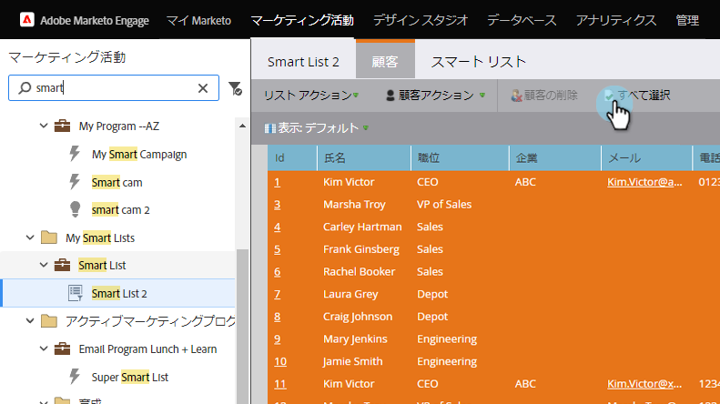
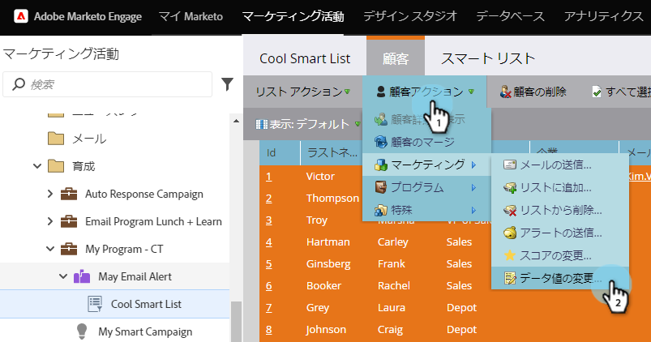
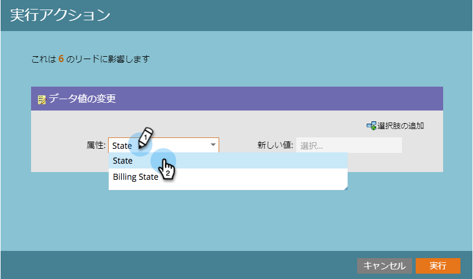
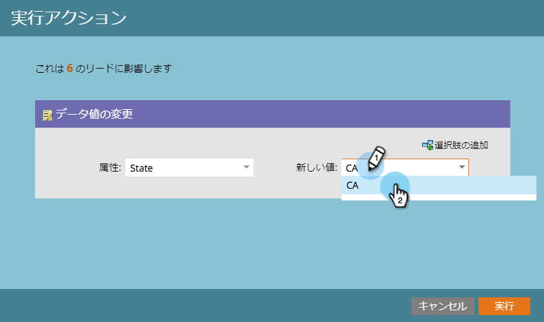
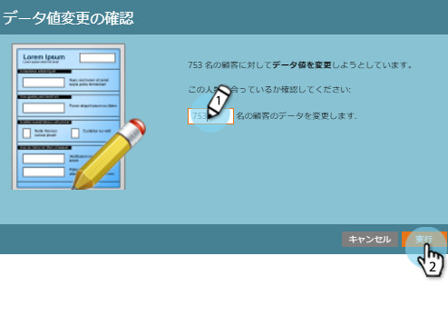
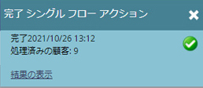

# スマートリストからの単一フローステップの実行{#run-a-single-flow-step-from-a-smart-list}

1回限りのフローステップを実行する場合は、スマートキャンペーン全体を作成する代わりに、スマートリスト内で1つのフローステップを使用できます。

>[!PREREQUISITES]
>
>* [スマートリストの作成](../../../../product-docs/core-marketo-concepts/smart-lists-and-static-lists/creating-a-smart-list/create-a-smart-list.md)

>

1. **マーケティングアクティビティ**&#x200B;に移動します。

   

1. リストまたはスマートリストを選択し、**ユーザー**&#x200B;タブに移動します。

   

   >[!TIP]
   >
   >この機能は、静的なリストとスマートリストの両方にあります。

1. 「**すべて選択**」をクリックします。 [** Ctrl/Cmd**]を使用し、いくつかのレコードを手動でクリックして選択することもできます。

   

   >[!NOTE]
   >
   >結果が複数のページにまたがる場合は、「**すべて選択**」をクリックすると、すべてのページのすべてのユーザーが選択されます。

1. 「**個人** **アクション**」で、選択したフローステップを選択します。 この例では、[データ値の変更](../../../../product-docs/core-marketo-concepts/smart-campaigns/flow-actions/change-data-value.md)を使用します。

   

1. **属性**&#x200B;を探して選択します。 この例では、州「California」を持つすべての人を「CA」に変更します。

   

1. 新しい値を入力します。 「**今すぐ実行**」をクリックします。

   

1. 多数のユーザーのデータ値を変更する場合は、数値を入力して変更の確認が必要になる場合があります。 「**Go For It**」をクリックします。

   

すごい仕事！ 右上隅に単一フローステップのステータスが表示されます。

完了したら、リストを更新すると、更新された情報が表示されます。
