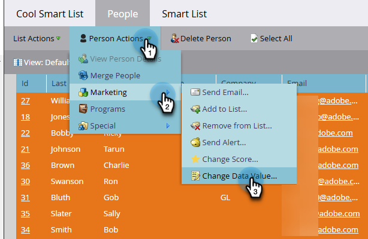

# スマートリストからの単一フローステップの実行 {#run-a-single-flow-step-from-a-smart-list}

1 回限りのフローステップを実行する場合は、スマートキャンペーン全体を作成する代わりに、スマートリスト内で 1 つのフローステップを使用できます。

>[!PREREQUISITES]
>
>[スマートリストの作成](/help/marketo/product-docs/core-marketo-concepts/smart-lists-and-static-lists/creating-a-smart-list/create-a-smart-list.md){target="_blank"}

1. 「**[!UICONTROL マーケティング活動]**」に移動します。

   

1. ユーザーが含まれているリストまたはスマートリストを選択し、「**[!UICONTROL ユーザー]**」タブに移動します。

   

   >[!TIP]
   >
   >静的リストとスマート・リストの両方にこの機能があります。

1. 「**[!UICONTROL すべてを選択]**」をクリックします。または、**Ctrl／Cmd** をクリックして、いくつかのレコードを手動で選択することもできます。

   

   >[!NOTE]
   >
   >結果が複数のページにまたがる場合は、「**[!UICONTROL すべてを選択]**」をクリックすると、すべてのページのすべての人物が選択されます。

1. **[!UICONTROL 人物アクション]** で、目的のフローステップを選択します。 この例では、「[データ値の変更](/help/marketo/product-docs/core-marketo-concepts/smart-campaigns/flow-actions/change-data-value.md){target="_blank"}」を使用します。

   

1. **[!UICONTROL 属性]**&#x200B;を検索して選択します。この例では、州「California」を持つすべての人物を対象に、州を「CA」に変更します。

   

1. 新しい値を入力します。「**[!UICONTROL 今すぐ実行]**」をクリックします。

   

1. 多数の人物のデータ値を変更する場合は、その数を入力して変更を確定する必要がある場合があります。「**[!UICONTROL 実行]**」をクリックします。

   

素晴らしいです。右上隅に単一フローステップのステータスが表示されます。

完了後にリストを更新すると、更新された情報が表示されます。
