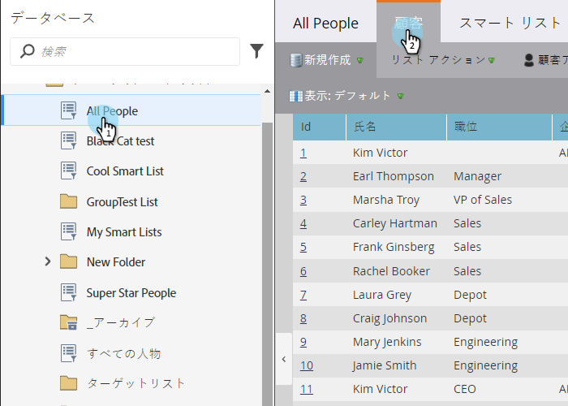

# 組み込み/システムスマートリストの使用 {#use-built-in-system-smart-lists}

Marketoには非常に役立つ組み込みスマートリストがいくつかあります。 彼らを調べよう！

>[!NOTE]
>
>マーケティング担当者は、ブラックリストやホワイトリストなどの用語を、当社の製品のブロックリスト許可リストやに変更する過程にあります。 この更新中、UIとドキュメントのスクリーンショットには古い用語が表示され、ドキュメントのテキストには新しい用語が表示される場合があります。 ご混乱をおかけして申し訳ございません。

1. 「**データベース**」に移動します。

   

1. 「 **システムスマートリスト** 」フォルダーを開き、コレクションを表示します。

   

1. 1つの例を見るには：「 **すべての人**」を選択し、「 **人** 」タブをクリックします。

   

   >[!NOTE]
   >
   >システムスマートリストのフィルターは、各スマートリスト/キャンペーンに適用する必要はありません。 その内容は自動的に認識されます。

   | リスト名 | 説明 |
   |---|---|
   | すべての人 | Marketoデータベース内のすべてのユーザー |
   | 登録解除されたユーザー | これらの人々には、操作用の電子メールしか送信できません。これは通常、個人自身が管理します。 |
   | マーケティングの中断 | これらの人々には、操作用の電子メールしか送信できません。これは通常、マーケティング担当者によって制御されます。 |
   | ブロックリスト | これらのユーザーは、メールを一切受け取りません。 |
   | バウンスされた電子メールアドレス | 配信不能な電子メールアドレスを持つユーザー、または電子メールを拒否するユーザー。 |
   | 可能な重複 | Marketoデータベース内で複製される可能性のあるユーザー。 |

組み込みのスマートリストの機能をまとめます。

>[!NOTE]
>
>システムスマートリストは削除できません。 可能な重複リストを除き、これらも編集できません。

>[!NOTE]
>
>**関連記事**
>
>* [スマートリストの作成](../../../../product-docs/core-marketo-concepts/smart-lists-and-static-lists/creating-a-smart-list/create-a-smart-list.md)

>

