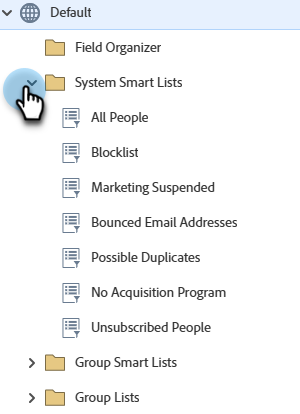
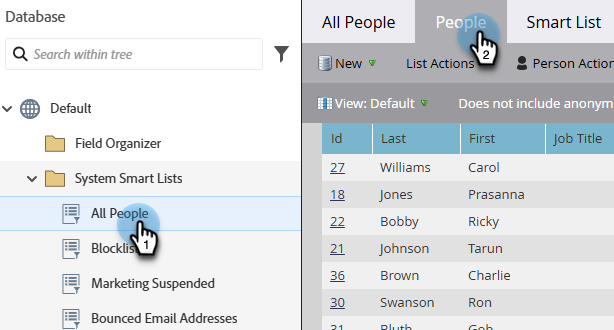

# 組み込みのシステムスマートリストの使用 {#use-built-in-system-smart-lists}

Marketo Engageには、一般的なセグメンテーション作業に役立つスマートリストが組み込まれています。

1. **[!UICONTROL データベース]**&#x200B;に移動します。

   

1. 「**[!UICONTROL システムスマートリスト]**」フォルダーを開き、内容を確認します。

   

1. 例として、「**[!UICONTROL すべてのリード]**」を選択して「**[!UICONTROL リード]**」タブをクリックします。

   

   >[!NOTE]
   >
   >システムスマートリスト内のフィルターは、各スマートリストやキャンペーンに適用する必要はありません。 内容は自動で認識されます。

次に、組み込みスマートリストの機能の概要を示します。

<table><thead>
  <tr>
    <th>リスト名</th>
    <th>説明</th>
  </tr></thead>
<tbody>
  <tr>
    <td>すべてのリード</td>
    <td>Marketo データベースに存在するすべてのリード</td>
  </tr>
  <tr>
    <td>登録解除済みのリード</td>
    <td>オペレーショナルメールのみ配信可能なリード（通常はリード本人が制御）。</td>
  </tr>
  <tr>
    <td>マーケティングを中断したリード</td>
    <td>オペレーショナルメールのみ配信可能なリード（通常はマーケターが制御）。</td>
  </tr>
  <tr>
    <td>ブロックリスト</td>
    <td>いかなる種類のメールも配信されないリード。</td>
  </tr>
  <tr>
    <td>バウンスメールアドレス</td>
    <td>無効あるいは配信拒否のメールアドレスを有するリード。</td>
  </tr>
  <tr>
    <td>重複の可能性</td>
    <td>Marketo データベース内で重複の可能性があるリード。</td>
  </tr>
</tbody>
</table>

>[!NOTE]
>
>システム スマート リストは削除できません。 「重複の可能性」リストを除き、編集することもできません。

>[!MORELIKETHIS]
>
>[スマートリストの作成](/help/marketo/product-docs/core-marketo-concepts/smart-lists-and-static-lists/creating-a-smart-list/create-a-smart-list.md){target="_blank"}
