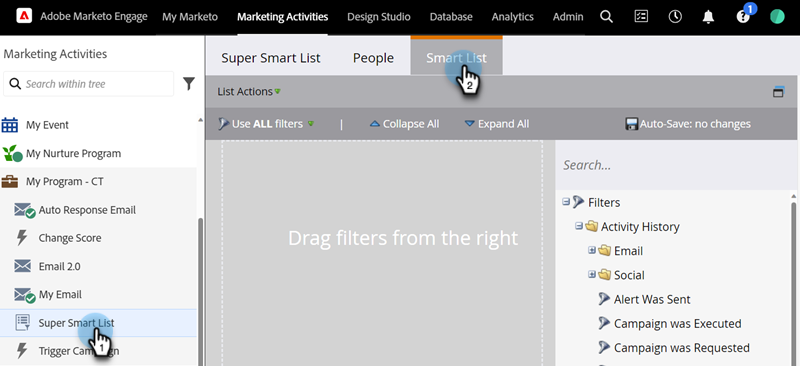

# スマートリストでの非アクティブフィルターの使用 {#use-inactivity-filters-in-a-smart-list}

スマートリストの中から&#x200B;_何も行わなかった_&#x200B;人物を検索できることをご存知ですか？非アクティブフィルターを使用します。

1. 「**[!UICONTROL マーケティング活動]**」に移動します。

   

1. 編集するスマートリストを選択し、「**[!UICONTROL スマートリスト]**」タブをクリックします。

   

1. 選択した非アクティブフィルターを見つけて、キャンバスにドラッグします。例として、ページを訪問したことのない人を見つけてみましょう。

   

   >[!TIP]
   >
   >**[!UICONTROL 非アクティブフィルター]**&#x200B;フォルダーには、フィルターがたくさんあります。「Not」を検索し、確認します。

1. **[!UICONTROL is any]** 演算子を選択します。これにより、過去 30 日間にどのページも訪問しなかったすべての人を検索します。

   
