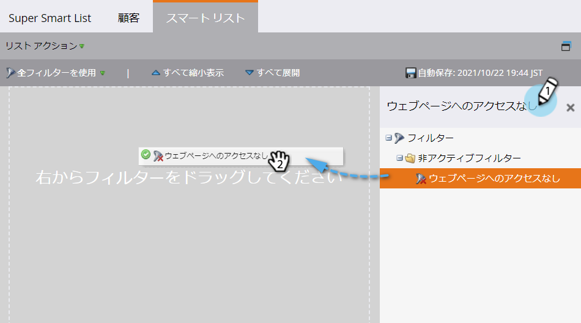
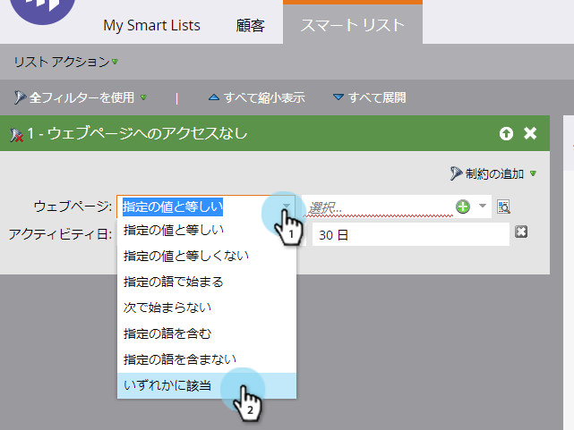

# スマートリストでの無操作フィルターの使用 {#use-inactivity-filters-in-a-smart-list}

何もしなかったスマートリストの人を探せ *ると* ? これらの無操作状態のフィルターを確認します。

1. 「 **マーケティングアクティビティ**」に移動します。

   

1. 編集するスマートリストを選択し、「 **スマートリスト** 」タブをクリックします。

   

1. 選択した無操作状態のフィルタを探し、キャンバスにドラッグします。 例として、どのページも訪問していない人を見つけてみましょう。

   

   >[!TIP]
   >
   >[ **無操作フィルター** ]フォルダには多くのフィルターがあります。 「 **Not** 」を検索し、チェックアウトします。

1. 「 **is any** 」演算子を選択します。 これにより、過去30日間にどのページも訪問していないすべての人が検索されます。

   

   そんな簡単じゃなかった？

