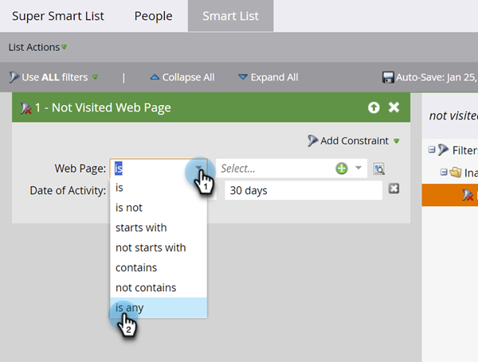

# スマートリストでの非アクティブフィルターの使用 {#use-inactivity-filters-in-a-smart-list}

非アクティビティフィルターを使用して、スマートリスト内の何もしないユーザーを検索します。

1. **[!UICONTROL マーケティングアクティビティ]**&#x200B;に移動します。

   

1. 編集するスマートリストを選択し、「**[!UICONTROL スマートリスト]**」タブをクリックします。

   

1. 選択した非アクティブフィルターを見つけて、キャンバスにドラッグします。 例えば、この例では、どのページにもアクセスしたことがないユーザーを見つけます。

   

   >[!TIP]
   >
   >**[!UICONTROL 非アクティブフィルター]**&#x200B;フォルダーには、フィルターがたくさんあります。 「Not」を検索し、確認します。

1. **[!UICONTROL is any]** 演算子を選択します。 これにより、過去 30 日間にどのページも訪問しなかったすべての人を検索します。

   
