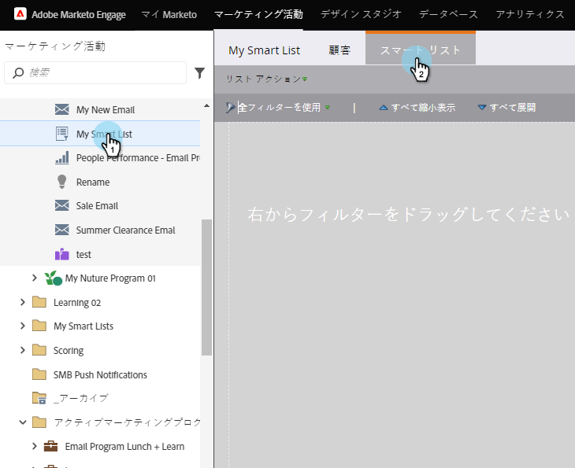
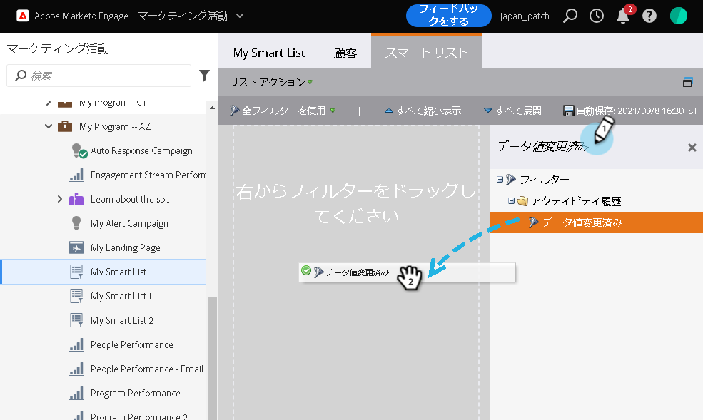
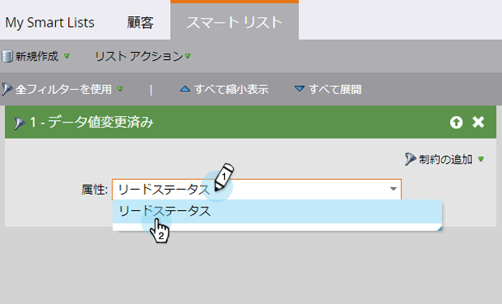

# スマートリストでのデータ値の変更フィルターの使用 {#use-the-data-value-changed-filter-in-a-smart-list}

値は常に変化し、Marketoデータベース内で更新されます。 特定の値を探す代わりに、値が変化した人を探したい場合があります。 これが方法です。

>[!PREREQUISITES]
>
>* [スマートリストの作成](../../../../product-docs/core-marketo-concepts/smart-lists-and-static-lists/creating-a-smart-list/create-a-smart-list.md)

>

1. 「**マーケティングアクティビティ**」領域に移動します。

   

1. スマートリストを選択し、「 **スマートリスト** 」タブをクリックします。

   

1. 「 **データ値の変更** 」フィルターを探し、キャンバスにドラッグします。

   

1. データ値の変更を検索するフィールドに **「属性** 」を設定します。

   

このフィルターは、ステータスに変更（変更）があったすべての人を検索します。 偶数のファンシャーを取得する場合は、スマートリストフィルターに制約を [追加してみます](add-a-constraint-to-a-smart-list-filter.md)。

>[!NOTE]
>
>**関連記事**
>
>* [スマートリストフィルター追加の制約](add-a-constraint-to-a-smart-list-filter.md)

>

