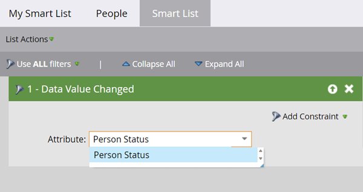

# スマートリストでのデータ値変更済みフィルターの使用 {#use-the-data-value-changed-filter-in-a-smart-list}

値は常に変更され、Marketo データベース内で更新されます。 特定の値を検索する代わりに、値が変わった人物を検索したい場合があります。

>[!PREREQUISITES]
>
>[スマートリストの作成](/help/marketo/product-docs/core-marketo-concepts/smart-lists-and-static-lists/creating-a-smart-list/create-a-smart-list.md){target="_blank"}

1. 「**[!UICONTROL マーケティング活動]**」領域に移動します。

   

1. スマートリストを選択し、「**[!UICONTROL スマートリスト]**」タブをクリックします。

   

1. 「**[!UICONTROL データ値変更済み]**」フィルターを適用してキャンバスにドラッグします。

   

1. データ値の変更を検索するフィールドに「**[!UICONTROL 属性]**」を設定します。

   

このフィルターは、ステータスに変更（あらゆる変更）が行われたすべての人物を検索します。 さらに検索する場合は、[スマートリストフィルターへの制約の追加](/help/marketo/product-docs/core-marketo-concepts/smart-lists-and-static-lists/using-smart-lists/add-a-constraint-to-a-smart-list-filter.md){target="_blank"}も試してみてください。
