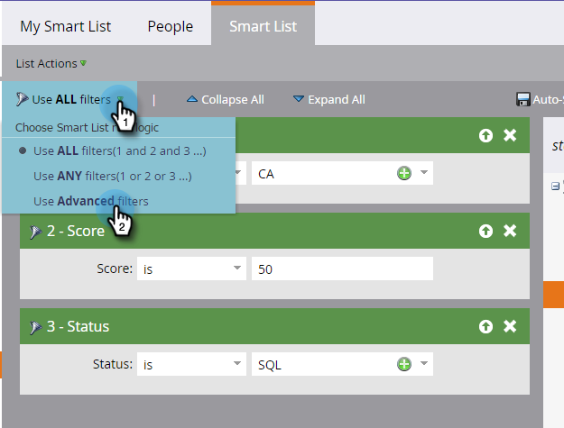
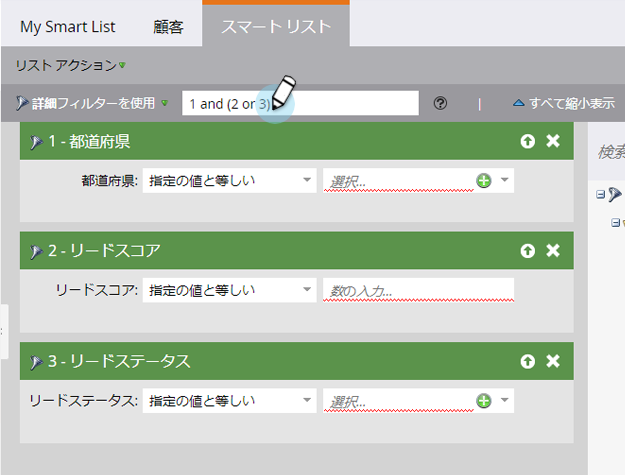
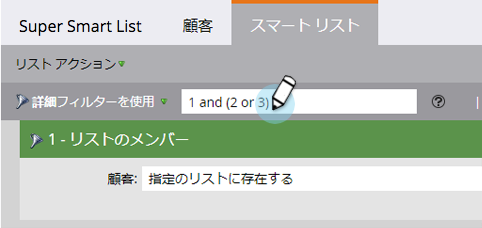
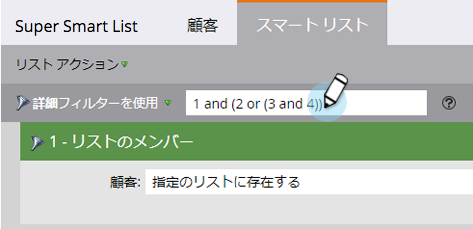

# 高度なスマートリストルールロジックの使用{#using-advanced-smart-list-rule-logic}

スマートリスト内の複数のフィルターにスマートリストルールロジックを適用すると、必要な人物を正確に検索できます。 これが方法です。

>[!PREREQUISITES]
>
>* [スマート・リストの検索と追加フィルター](../../../../product-docs/core-marketo-concepts/smart-lists-and-static-lists/creating-a-smart-list/find-and-add-filters-to-a-smart-list.md)
>* [スマートリストフィルターの定義](../../../../product-docs/core-marketo-concepts/smart-lists-and-static-lists/creating-a-smart-list/define-smart-list-filters.md)

>

>[!NOTE]
>
>アドバンスフィルターロジックは、スマートリストに3つ以上のフィルターがある場合にのみ使用できます。

## ス追加マートリストへのロジック{#add-logic-to-a-smart-list}

デフォルトでは、スマートリストは、**すべての**&#x200B;フィルター(フィルター1 *と* 2 *と* 3)に一致する人を見つけます。 ルールロジックを変更して、定義されたフィルターの&#x200B;**ANY**&#x200B;に一致する人(フィルター1 *または* 2 *または* 3)を探すか、高度なフィルター(フィルター1 *と* 2 *or *3)を使用できます。

この例では、カリフォルニア&#x200B;*と*&#x200B;のスコアが50ポイント以上&#x200B;*または*&#x200B;で、ステータスが「Sales Qualified」の人を探すとします。

1. ドロップダウンから「******詳細****フィルター**&#x200B;を使用」を選択します。

   

   >[!NOTE]
   >
   >**高度な**&#x200B;フィルターを使用すると、スマートリストのメンバーフィルターを使用してスマートリストを作成する必要が少なくなります。 これにより、パフォーマンスを最適化できます。

1. 「**詳細** **フィルター**」テキストボックスには、すべてのフィルター間のデフォルト値として「and」が表示されます。

   

1. 「2と3」を括弧で囲んで入力します。

   

   >[!CAUTION]
   >
   >ルールロジックを入力する際は、「or」の前に「and」を使用する必要があります。

1. 「and」を「2」から「3」に変更して、「or」にします。

   

## 「And」と「Or {#use-parentheses-when-mixing-and-and-or}」を混ぜる場合は丸括弧を使用

「and」と「or」のロジックを混在させる場合、意図を明確にするには括弧が必要です。

## 必要に応じて4つ以上のフィルターに入れ子の丸括弧を使用{#use-nested-parentheses-for-four-or-more-filters-if-needed}

意図に応じて、4つ以上のフィルターを使用する場合は、入れ子の丸括弧の追加が必要になる場合があります。

>[!TIP]
>
>無効なルールを入力すると、そのルールの下に赤い線が表示されます。 テキストをスクロールすると、関連するエラーメッセージが表示されます。

