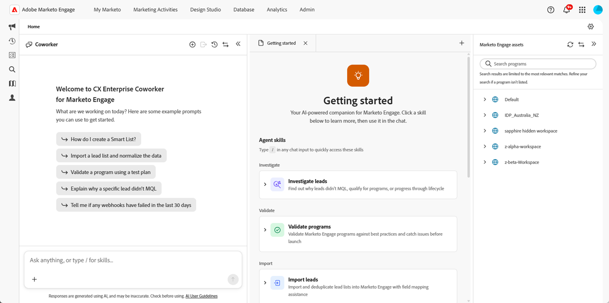

# CX Enterprise Coworker for Marketo Engageの概要 {#overview}

CX Enterprise Coworker for Marketo Engageは、時間はかかりますが、重要なマーケティング機能を自動化するために設計された担当者のスキルを提供します。

>[!AVAILABILITY]
>
>この機能は、すべてのサブスクリプションで利用できます。 My Marketo画面にCX Enterprise Coworker for Marketo Engage タイルが表示されない場合は、アカウントマネージャーにお問い合わせください。 また、[ コア生成AIの利用条件および補足条件](https://www.adobe.com/legal/terms/enterprise-licensing/genai-ww.html){target="_blank"}に同意する必要があります。

>[!IMPORTANT]
>
>* Marketo Engage用CX Enterprise Coworkerがサブスクリプションに対して有効になった後、必要なユーザーがアクセスできるようにするには、いくつかの[ セットアップ手順](/help/marketo/product-docs/coworker-for-marketo/settings-setup.md){target="_blank"}を実行する必要があります。
>
>* CX Enterprise Coworker for Marketo Engage [ データインフォメーションシート ](/help/marketo/product-docs/coworker-for-marketo/data-information.md){target="_blank"}で、データスコープ、ガバナンス制御、およびPIIに関する考慮事項を確認します。

## アクセス方法 {#access}

マイMarketo画面で、「**CX Enterprise Coworker Marketo Engage版**」タイルをクリックします。

プロンプトフィールドにリクエストを入力するか、エージェントスキルのいずれかを選択するか、サンプルプロンプトのいずれかを試します。

## スキル {#skills}

センターコンソールには、さまざまなタスクを支援するために利用できるエージェントのスキルのセットが増えています。 各スキルは、特定のタスクを完了するために自然言語を通じて操作する、専用のAI アシスタントです。

### プログラムの構築 {#build-programs}

マーケティングキャンペーンをわかりやすい言葉で説明し、CX Enterprise Coworker for Marketo Engageでプログラム構造を構築し、アセットのプレースホルダーとスケジューリングを備えています。 [ プログラムの作成スキル ](/help/marketo/product-docs/coworker-for-marketo/skills/build-programs.md){target="_blank"}について詳しく説明します。

### リードの調査 {#investigate-leads}

特定のリードがマイルストーン（MQL、プログラムのクオリフィケーション、キャンペーンなど）に到達しなかった理由を突き止め、何が起こったのかを平易な言葉で説明できます。 [ リードの調査スキル ](/help/marketo/product-docs/coworker-for-marketo/skills/investigate-leads.md){target="_blank"}について詳しく説明します。

### 製品知識 {#product-knowledge}

Adobe Experience Managerのオンデマンド機能を利用すれば、IT部門に依頼することなく、Marketoの専門知識を活用できます。 平易な言葉で質問し、Adobeの公式ドキュメントにもとづいてMarketo Engage向けCX Enterprise Coworkerで回答します。 [製品知識スキル ](/help/marketo/product-docs/coworker-for-marketo/skills/product-knowledge.md){target="_blank"}について詳しく説明します。

### プログラムの検証 {#validate-programs}

プログラムの検証では、設定をMarketoのベストプラクティスに照らし合わせて自動的に検証し、ローンチ前に問題を表面化します。 プログラムの検証スキル [について詳しくは、こちらを参照してください](/help/marketo/product-docs/coworker-for-marketo/skills/validate-programs.md){target="_blank"}。

### リードの読み込み {#import-leads}

フィールドマッピング機能を利用すれば、リードリストをMarketo Engageデータベースにインポートして重複を排除できます。 [ リードの読み込みスキル ](/help/marketo/product-docs/coworker-for-marketo/skills/import-leads.md){target="_blank"}について詳しく説明します。

## 近日リリース予定 {#coming-soon}

最も反復的で時間のかかる作業を処理するために設計された追加のエージェントが、近日リリースされる予定です。

* リードがMQLを実行しなかった理由や、ライフサイクルを先に進めた理由を診断します。
* キャンペーン概要から、包括的なMarketo Engageプログラムを直接生成できます。
* その他。

>[!MORELIKETHIS]
>
>[Marketo Engage MCP Server](https://experienceleague.adobe.com/docs/marketo-developer/marketo/mcp-server.html){target="_blank"}は、AI アシスタントとMarketo Engageの間の橋渡しの役割を果たします。
