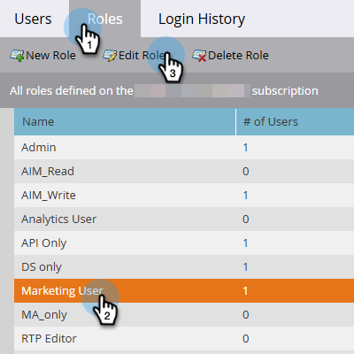
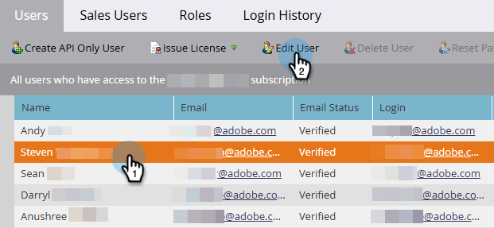
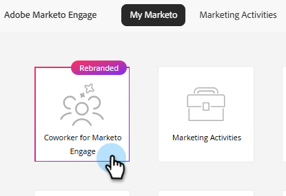

# 設定と設定 {#settings-setup}

権限を有効にし、設定エリアを使用して接続の詳細を表示し、組織ルールを定義し、統合と通知を設定する方法を説明します。

>[!AVAILABILITY]
>
>この機能は、すべてのサブスクリプションで利用できます。 My Marketo画面にCoworker for Marketo Engage タイルが表示されない場合は、アカウントマネージャーにお問い合わせください。 また、[&#x200B; コア生成AIの利用条件および補足条件](https://www.adobe.com/legal/terms/enterprise-licensing/genai-ww.html){target="_blank"}に同意する必要があります。

## 権限と役割 {#permission-and-role}

Marketo Engage用の&#x200B;_アクセス共同作業者_&#x200B;権限とMarketo Engage用の&#x200B;_共同作業者_&#x200B;権限があり、管理者はMarketo Engage用の&#x200B;**共同作業者**&#x200B;機能にアクセスできるユーザーをより詳細に制御できます。 権限はロールレベルで割り当てられます。 Marketo Engage ユーザー&#x200B;_の_ Coworker ロールには、デフォルトで有効になっている&#x200B;_Access Coworker for Marketo Engage_&#x200B;権限が付与されています。

>[!NOTE]
>
>Marketo Engage _の_ Access Coworker権限は、すべてのロールに対してデフォルトで有効になっていません。 詳しくは、以下の表を参照してください。

| 役割 | デフォルトステータス |
| --- | --- |
| 管理 | 有効 |
| アドビ製品管理者 | 有効 |
| マーケティングユーザ | 無効 |
| 標準ユーザー | 利用できません |
| Marketo Engage ユーザーの共同作業 | 有効 |
| カスタム役割 | 無効 |

### Marketo Engage用Coworker権限へのアクセス {#access-coworker-marketo-permission}

次の手順に従って、条件を満たすロールのうち、まだ有効になっていないロールに対してMarketo Engage _の_ Access Coworkerを有効にします。

1. マイMarketoで、**管理者**、**ユーザーと役割**&#x200B;の順にクリックします。

   

1. 「_役割_」タブで、目的の役割を選択し、**役割を編集**&#x200B;をクリックします。

   

1. 下にスクロールして「_Marketo Engage用に同僚にアクセス_」チェックボックスをオンにし、**保存**&#x200B;をクリックします。

   

   >[!NOTE]
   >
   >これらの同じ手順を使用して、**実行**&#x200B;で「_Marketo Engage用に同僚にアクセス_」チェックボックスをオンにして、権限を削除できます。

### Marketo Engage ユーザーロールの共同作業者 {#coworker-marketo-user-role}

次の手順に従って、特定のユーザーを&#x200B;_Coworker for Marketo Engage User_ ロールに割り当てます。

>[!NOTE]
>
>このロール **のみ**&#x200B;には、Marketo Engage _の_ アクセス共同作業者の権限が含まれています。

1. マイMarketoで、**管理者**、**ユーザーと役割**&#x200B;の順にクリックします。

   

1. 目的のユーザーを選択し、**ユーザーの編集**&#x200B;をクリックします。

   

1. _役割とワークスペース_&#x200B;で、「_Marketo Engage ユーザーの同僚_」チェックボックスをオンにします。 複数のワークスペースがある場合は、**+**&#x200B;署名ドロップダウンで、アクセスを取得するワークスペースを指定できます。 終了したら「**保存**」をクリックします。

   

### カスタム役割 {#custom-role}

また、[新しいロール &#x200B;](https://experienceleague.adobe.com/en/docs/marketo/using/product-docs/administration/users-and-roles/create-delete-edit-and-change-a-user-role#create-a-role){target="_blank"}を作成して、その権限をカスタマイズし、Marketo Engage _の_ Access Coworkerを他の任意のロールと共に追加し、そのロール [&#128279;](https://experienceleague.adobe.com/en/docs/marketo/using/product-docs/administration/users-and-roles/managing-user-roles-and-permissions#assign-roles-to-a-user){target="_blank"}を特定のユーザーに割り当てることもできます。

## 設定 {#settings}

1. My Marketoで、**[!UICONTROL Coworker for Marketo Engage]** タイルをクリックします。

   

1. 歯車のアイコンをクリックします。

   

### 接続 {#connection}

このタブには編集可能なフィールドが含まれていません。 Munchkin IDやIMS組織などのアカウント情報が表示されます。

### 組織ルール {#organizational-rules}

Marketo Engage アセットを作成または変更する際に、Marketo Engageの共同作業者が従う組織ガイドラインと制約を定義します。

{width="800" zoomable="yes"}

>[!NOTE]
>
>ルールは、YAML frontmatterでMarkdown形式を使用します。 グローバルルールはすべてのワークスペースに適用されます。 Workspace ルールは、グローバル設定を上書きします。

### 統合（近日公開予定） {#integrations}

外部サービスおよびAPIへの接続を設定します。

_このタブはUIに表示されますが、まだ使用できません。 更新プログラム_&#x200B;を確認してください。

### 通知（近日リリース予定） {#notifications}

アラートの環境設定と通知チャネルを管理します。

_このタブはUIに表示されますが、まだ使用できません。 更新情報_&#x200B;については、この記事を確認してください。
