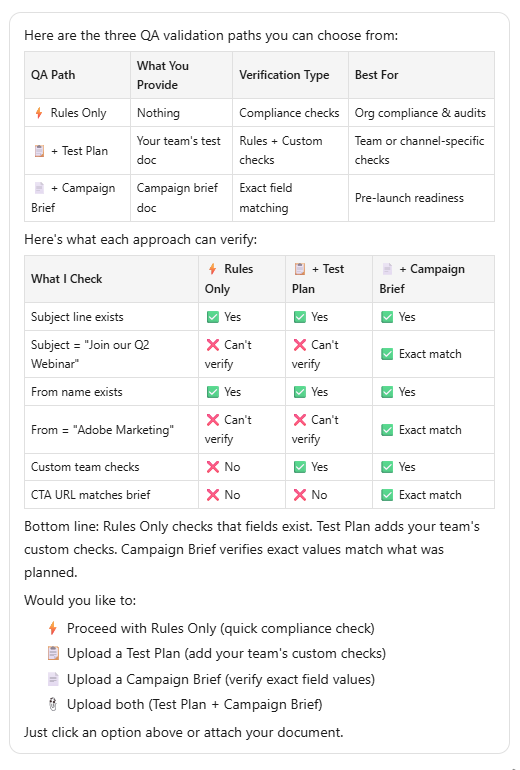

# プログラムの検証 {#validate-programs}

メール、ランディングページ、キャンペーンなど、あらゆるコンポーネントをまたいでベストプラクティスのプログラムを監査します。

## 使用方法 {#how-to-use}

1. マイMarketoで、「**CX Enterprise Coworker Marketo Engage版**」タイルをクリックします。

   

1. プロンプトウィンドウに「Marketo Engage プログラムを検証したい」と入力します。

   

1. 右側のパネルで、検証するプログラムを選択します。

   {width="800" zoomable="yes"}

   選択したプログラムの概要が中央のペインに表示されます。

1. プロンプトウィンドウで、「プログラムを検証」と入力し、**送信**&#x200B;をクリックします。

   CX Enterprise Coworker for Marketo Engageは、選択したプログラムのQAを提供し、何が合格し、何が失敗したかを示します。

   
