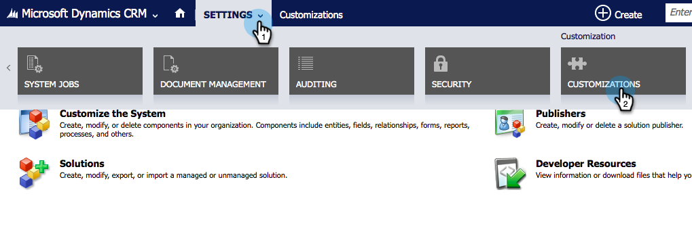
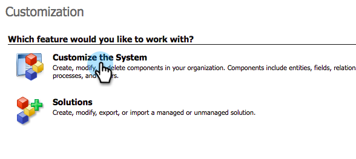
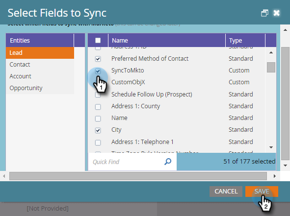
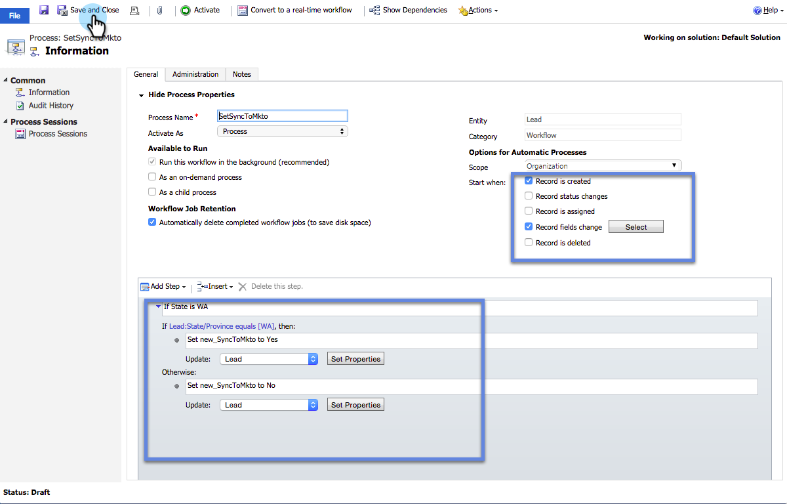

# カスタム Dynamics 同期フィルターの作成 {#create-a-custom-dynamics-sync-filter}

Dynamics CRM のすべての項目を Marketo に同期しない場合でも心配無用です。Marketo では、同期フィルターを設定して、レコードの一部のみを同期できます。

## 概要 {#overview}

Dynamics 同期フィルターを設定するには、次のようにします。

1. 任意のオブジェクト（リード、連絡先、アカウント、商談、その他のカスタムエンティティ）に対して、Dynamics CRM で new_synctomkto という名前のカスタム 2 つのオプション（ブール値）フィールドを作成します。
1. このフィールドには、はい／いいえの値を割り当てるか、空白のままにします。

>[!NOTE]
>
>これらの変更は、データベースや Marketo ではなく、Dynamics CRM でおこなう必要があります。

Marketo は、自動バックグラウンド同期中にこのフィールドを探し、このロジックに基づいて同期するレコードを判定します。

| フィールド値 | Marketo に同期？ |
|---|---|
| フィールドが存在しない | はい |
| フィールドが空 | はい |
| フィールド値が Yes | はい |
| フィールド値が No | いいえ |

>[!CAUTION]
>
>レコードをスキップするように Marketo に伝える唯一の方法は、フィールドの値を明示的に **No** に設定することです。Marketo は、フィールドの値が空でもレコードを同期します。

>[!PREREQUISITES]
>
>最新バージョンの Marketo プラグイン（3.0.0.1 以降）をインストールします。Marketo／管理／Microsoft Dynamics／Marketo ソリューションをダウンロードに移動します。

## SyncToMkto フィールドの作成 {#create-synctomkto-field}

1. Dynamics CRM にログインします。「**設定**」をクリックし、「**カスタマイズ**」をクリックします。

   

1. 「**システムをカスタマイズ**」をクリックします。

   

1. 「**エンティティ**」の横にあるをクリックします。

   

1. 「**リード**」の横にあるをクリックし、「**フィールド**」を選択します。次に、「**新規**」をクリックします。

   

1. 「**表示名**」フィールドに **SyncToMkto** と入力し、「**データタイプ**」として「**2 つのオプション**」を選択します。次に、「**保存して閉じる**」をクリックします。

   

   >[!NOTE]
   >
   >このフィールドの表示名を任意に選択しますが、「名前」フィールドは正確に **new_synctomkto** にする必要があります。デフォルトのプレフィックスとして **new**  を使用する必要があります。デフォルトを変更した場合は、ここに移動して、](/help/marketo/product-docs/crm-sync/microsoft-dynamics-sync/create-a-custom-dynamics-sync-filter/set-a-default-custom-field-prefix.md)カスタムフィールド名のデフォルトのプレフィックスをリセットします[。新しいフィールドを作成した後で、このフィールドを元に戻すことができます。

   >[!NOTE]
   >
   >非同期ワークフローを設定している場合、レコードは、フィールドで設定したデフォルトの SyncToMkto 値を取得し、ワークフローの実行が終了した数秒後に正しい値を取得します。デフォルト値が「はい」に設定されている場合、これらのレコードは Marketo で作成されて古くなります。これを回避するには、**いいえ**&#x200B;をデフォルト値として使用します。

1. このプロセスを繰り返し、連絡先、アカウント、商談、カスタムエンティティなど、同期を制限する他のエンティティ用に  **SyncToMkto** フィールドを作成します。

## Marketo でフィルターを選択する {#select-the-filter-in-marketo}

初期同期が既に完了している場合は、中に移動し、Marketo と同期するフィールドを選択します。

1. 管理に移動し、「**MIcrosoft Dynamics**」を選択します。

   

1. 「フィールド同期の詳細」で「**編集**」をクリックします。

   

1. 下にスクロールしてフィールドを確認します。実際の名前は new_synctomkto にする必要がありますが、表示名は任意の名前にすることができます。「**保存**」をクリックします。

   

これで、Marketo の同期フィルターが有効になりました。

## 同期フィルター値を自動的に割り当てる Dynamics ワークフローを作成する {#create-a-dynamics-workflow-to-assign-sync-filter-values-automatically}

レコードの SyncToMkto フィールドには、いつでも手動で値を割り当てることができます。ただし、Dynamics Workflow の機能を活用し、レコードの作成時や更新時に SyncToMkto フィールドに値を自動割り当てすることをお勧めします。

>[!NOTE]
>
>データベースレベルでは、この操作はできません。CRM では、これは手動でおこなうか、ワークフローを使用する必要があります。
>
>Dynamics ワークフローは、今後作成される新しいレコードに対してのみ機能し、履歴データには機能しません。バッチアップデートを使用して、既存のレコードを移動します。

1. Dynamics CRM に移動します。「**設定**」をクリックし、「**プロセス**」をクリックします。

   

1. 「**新規**」をクリックします。

   

1. ワークフローの名前を入力し、カテゴリとして「**ワークフロー**」を選択し、エンティティとして「**リード**」を選択します。次に、「**OK**」をクリックします。

   

1. 組織の好みに応じて、**SyncToMkto** フィールドに true または false の値を割り当てるルールを作成します。「**保存して閉じる**」をクリックします。

   

   >[!NOTE]
   >
   >「**ステップの追加**」をクリックしてチェック条件を追加した後に、デフォルトのアクションを定義します。同期しないレコードを&#x200B;**いいえ**&#x200B;と設定します。それ以外の場合は、同期されます。

1. ワークフローを選択し、「**アクティブ化**」をクリックします。

   

   >[!TIP]
   >
   >メールアドレスを持つユーザーのレコードのみを同期するルールを設定するには、「[メールアドレスのカスタム同期フィルタールール](/help/marketo/product-docs/crm-sync/microsoft-dynamics-sync/create-a-custom-dynamics-sync-filter/custom-sync-filter-rules-for-an-email-address.md)」を参照してください。

## 同期フィルターの詳細 {#sync-filter-details}

以下に、必要な実装の詳細を示します。

1. 同期操作の開始

   **SyncToMkto** の値が&#x200B;**いいえ**&#x200B;から&#x200B;**はい**&#x200B;に変わると、Dynamics は直ちに Marketo にこのレコードの同期を開始するよう通知します。レコードが既に存在する場合は、Marketo によってアップデートされます。それ以外の場合は、レコードが作成されます。

   >[!TIP]
   >
   >これが発生すると、`Create [StartSync]`操作が Marketo ログに追加されます。

1. 同期操作の停止

   レコードの SyncToMkto 値が Yes から No に変更されると、Marketo にこのレコードの同期を停止するよう通知されます。ただし、レコードは削除されず、アップデートの取得が停止され、古くなります。

>[!MORELIKETHIS]
>
>* [Microsoft Dynamics 同期フィルター：適合](/help/marketo/product-docs/crm-sync/microsoft-dynamics-sync/create-a-custom-dynamics-sync-filter/microsoft-dynamics-sync-filter-qualify.md)
>* [Microsoft Dynamics 同期フィルター：結合](/help/marketo/product-docs/crm-sync/microsoft-dynamics-sync/create-a-custom-dynamics-sync-filter/microsoft-dynamics-sync-filter-merge.md)
>* [メールアドレスのカスタム同期フィルタールール](/help/marketo/product-docs/crm-sync/microsoft-dynamics-sync/create-a-custom-dynamics-sync-filter/custom-sync-filter-rules-for-an-email-address.md)

