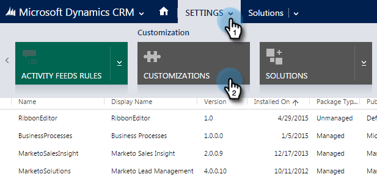

# デフォルトのカスタムフィールドプレフィックスの設定 {#set-a-default-custom-field-prefix}

Marketo固有のフィールドを正しく同期させるには、カスタムフィールドの既定のMicrosoft Dynamicsプレフィックスを **新しいものにする必要があります** 。 デフォルトのプレフィックスを変更する方法を次に示します。

1. 「設定」に移動し、「 **カスタマイズ」を選択します。**

   ** 

   **

1. 「 **発行者**」をクリックします。

   

1. リストからデフォルトの投稿者を選択します。

   

1. プレフィックスを **newに変更します**。 「 **保存して閉じる**」をクリックします。

   

1. 設定/ソリューションに移動して、カスタマイズを公開します。

   

1. 「すべてのカスタマイズを **発行**」をクリックします。

   

1. 次に、カスタムフィールドを作成します。 これらの設定が完了したら、プリフィックスを元のプリフィックスに戻します。

