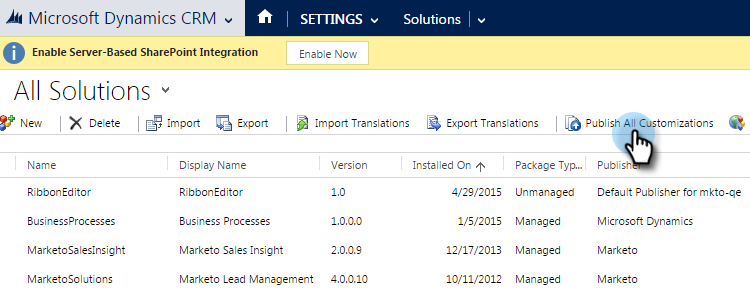

# デフォルトのカスタムフィールド接頭辞の設定 {#set-a-default-custom-field-prefix}

カスタムフィールドのデフォルトの [!DNL Microsoft Dynamics] 接頭辞は、Marketo 独自のフィールドを正しく同期させるために、**new** である必要があります。デフォルトの接頭辞を変更する方法を次に示します。

1. 「[!UICONTROL 設定]」に移動し、「**[!UICONTROL カスタマイズ]」を選択します。**

   

1. 「**[!UICONTROL 公開者]**」をクリックします。

   

1. リストからデフォルトの公開者を選択します。

   

1. 接頭辞を **new**.に変更します。「**[!UICONTROL 保存して閉じる]**」をクリックします。

   

1. [!UICONTROL 設定]／[!UICONTROL ソリューション]に移動して、カスタマイズを公開します。

   

1. 「**[!UICONTROL すべてのカスタマイズを公開]**」をクリックします。

   

1. 次に、カスタムフィールドを作成します。完了したら、接頭辞を元の接頭辞に戻します。
