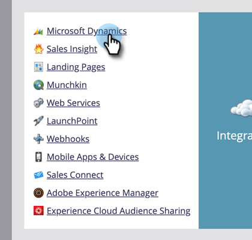

# キャンペーン同期の有効化 {#enable-campaign-sync}

このオプションを使用すると、Marketo は MS Dynamics キャンペーンにメンバーを追加および削除できます。

>[!PREREQUISITES]
>
>Marketo 用 Dynamics プラグインを最新バージョンに更新します。

>[!NOTE]
>
>**管理者権限が必要**

1. My Marketo で、「**管理者**」をクリックします。

   

1. 「**Microsoft Dynamics**」をクリックします。

   

1. 「同期オプション」で、「**編集**」をクリックします。

   

1. 「**Microsoft Dynamics キャンペーンの同期を有効にする**」チェックボックスを選択して「**保存**」をクリックします。

   

これで手順は完了です。Microsoft Dynamics からデータを取り込んで同期するまで時間を置いてください。これで準備は完了です。

>[!NOTE]
>
>「Dynamics キャンペーン同期」チェックボックスをリセットすると、以前に同期されたすべてのキャンペーンデータと、Dynamics のマーケティングリストとの関連付けが更新されます。
