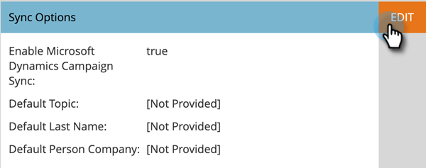

# キャンペーン同期の有効化 {#enable-campaign-sync}

このオプションを使用すると、Marketo は [!DNL MS Dynamics] キャンペーンにメンバーを追加および削除できます。

>[!PREREQUISITES]
>
>Marketo 用 [!DNL Dynamics] プラグインを最新バージョンにアップデートします。

>[!NOTE]
>
>**管理者権限が必要**

1. **[!UICONTROL My Marketo]** で、「**[!UICONTROL 管理者]**」をクリックします。

   

1. 「**[!UICONTROL Microsoft Dynamics]**」をクリックします。

   

1. 「**[!UICONTROL 同期オプション]**」で、「**[!UICONTROL 編集]**」をクリックします。

   

1. 「**[!UICONTROL Microsoft Dynamics キャンペーンの同期を有効にする]**」チェックボックスを選択して「**[!UICONTROL 保存]**」をクリックします。

   

同期に[!DNL Microsoft Dynamics]からデータを取得する時間を与えてください。

>[!NOTE]
>
>「[!DNL Dynamics] キャンペーン同期」チェックボックスをリセットすると、以前に同期されたすべてのキャンペーンデータと、[!DNL Dynamics] のマーケティングリストとの関連付けが更新されます。
