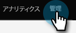
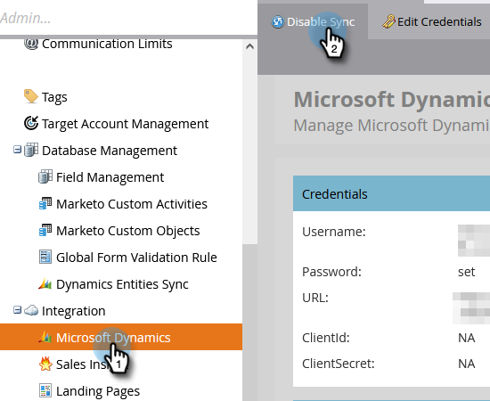
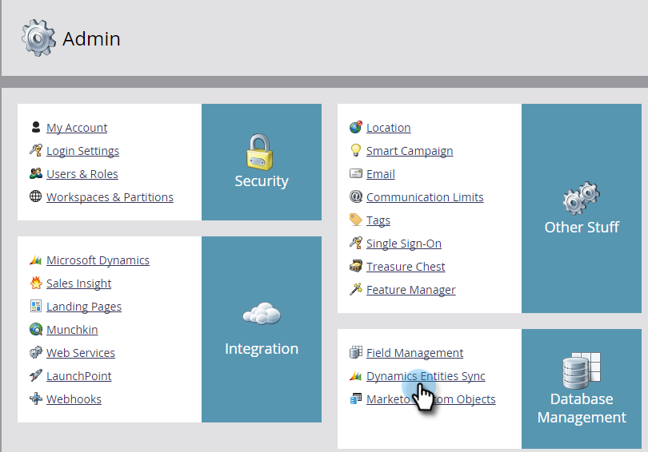
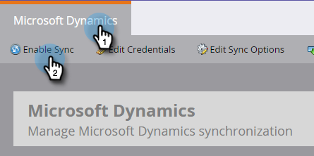

# カスタムエンティティの同期の有効化 {#enable-sync-for-a-custom-entity}

[!DNL Dynamics]のカスタムエンティティデータをMarketo Engageで利用できるようにする必要がある場合は、次の手順に従います。

>[!PREREQUISITES]
>
>カスタムオブジェクトを使用するには、カスタムオブジェクトは Microsoft Dynamics で[リード](/help/marketo/product-docs/crm-sync/microsoft-dynamics-sync/microsoft-dynamics-sync-details/microsoft-dynamics-sync-lead-sync.md){target="_blank"}、[取引先責任者](/help/marketo/product-docs/crm-sync/microsoft-dynamics-sync/microsoft-dynamics-sync-details/microsoft-dynamics-sync-contact-sync.md){target="_blank"}、[アカウント](/help/marketo/product-docs/crm-sync/microsoft-dynamics-sync/microsoft-dynamics-sync-details/microsoft-dynamics-sync-account-sync.md){target="_blank"}オブジェクトのいずれかに関連付けられている必要があります。

>[!NOTE]
>
>* カスタムエンティティの同期を有効にすると、Marketo で初期同期が実行され、カスタムオブジェクトのすべてのデータが取り込まれます。
>* マーケティングリストとマーケティングリストのメンバーは、この時点では&#x200B;_サポート対象外_&#x200B;です。

>[!IMPORTANT]
>
>Marketo 同期ユーザは、カスタムオブジェクトをリストし、同期を実行するために、カスタムオブジェクトへの読み取りアクセス権が必要です。

1. 「**[!UICONTROL 管理者]**」セクションに移動します。

   

1. 「**[!UICONTROL Microsoft Dynamics]**」を選択し、「**[!UICONTROL 同期を無効にする]**」をクリックします。

   

   >[!NOTE]
   >
   >カスタムエンティティを有効または無効にするには、グローバル同期を一時的に無効にする必要があります。

1. [!UICONTROL データベース管理]にある「**[!UICONTROL Dynamics エンティティ同期]**」リンクをクリックします。

   

1. 「**[!UICONTROL スキーマを同期]**」リンクをクリックします。

   

1. 同期するエンティティを選択し、「**[!UICONTROL 同期を有効にする]**」をクリックします。

   

1. 同期するまたはスマートリストの[制約](/help/marketo/product-docs/core-marketo-concepts/smart-lists-and-static-lists/using-smart-lists/add-a-constraint-to-a-smart-list-filter.md)やトリガーとして使用するフィールドを選択します。 完了したら、「**[!UICONTROL 同期を有効にする]**」をクリックします。

   

   >[!NOTE]
   >
   >同期の処理中に、「[!UICONTROL Dynamic エンティティ同期]」項目がナビゲーションツリーから消える場合があります。 これは期待された動作で、この項目は同期が完了した後で再び表示されます。

1. エンティティに緑のチェックマークが付きます。

   

1. グローバル同期を再度有効にします。

   

   >[!NOTE]
   >
   >* Marketo では、1 レベルまたは 2 レベルの深さの標準エンティティにリンクされたカスタムエンティティのみがサポートされています。
   >
   >* カスタムオブジェクトツリーは、メインオブジェクトの 1 つ（リード、取引先責任者、アカウントなど、または中間オブジェクトを介した間接接続など）との直接接続により、同じオブジェクトを複数回表示する場合があります。 このような場合は、メインオブジェクトに最も近いオブジェクトを選択し、1 つだけ選択します。 同じオブジェクトを複数回選択すると、そのカスタムオブジェクトの同期が妨げられる場合があります。
