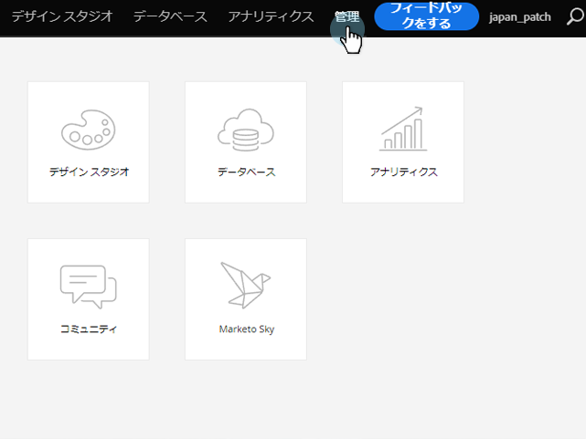

# Microsoft Dynamics同期：カスタムエンティティ同期 {#microsoft-dynamics-sync-custom-entity-sync}

DynamicsのデータをMarketoで使用できるようにするために、最初のカスタムエンティティ同期を有効にする必要がある場合は、次の方法を使用します。

>[!NOTE]
>
>**必要な管理者権限**

>[!PREREQUISITES]
>
>カスタムオブジェクトを使用するには、Dynamicsの [リード](microsoft-dynamics-sync-lead-sync.md)、 [連絡先](microsoft-dynamics-sync-contact-sync.md)、または アカウントオブジェクトに関連付ける必要があります。

>[!CAUTION]
>
>カスタムエンティティの同期を開始する前に、初期同期が完了している（電子メールで通知される）ことを確認します。

1. 「管理者」セクションに移動します。

   

1. 「同期を **無効にする** 」をクリックして、標準のグローバル同期を一時的に無効にします。

   

1. カスタムエンティティの同期（2_0_0_2の後）をサポートするバージョンのMicrosoft Dynamicsをインストールします。 Microsoft Dynamicsの [Marketoプラグインリリースを参照してください](../../../../product-docs/crm-sync/microsoft-dynamics-sync/marketo-plugin-releases-for-microsoft-dynamics.md)。
1. 同期する予定のエンティティに対する読み取りアクセス権を、マーケティング担当者に付与します。
1. [データベースの管理]で、[** Dynamicsエンティティ同期**]リンクをクリックします。

   

1. 「 **同期スキーマ** 」リンクをクリックして、使用可能なカスタムエンティティのリストを表示します。

   

1. リストの同期後、同期するフィールドと、スマートリストで [制約](../../../../product-docs/core-marketo-concepts/smart-lists-and-static-lists/using-smart-lists/add-a-constraint-to-a-smart-list-filter.md) /トリガーとして使用するフィールドを選択します。 完了したら、「同期を **有効にする**」をクリックします。

   

1. グローバル同期を再度有効にします。

   

   >[!NOTE]
   >
   >マーケティング担当者は、1 ～ 2レベルの深さの標準エンティティにリンクされたカスタムエンティティのみをサポートしています。

   >[!NOTE]
   >
   >エンティティ名は最大** 33文字**まで指定できます。

いいぞ！