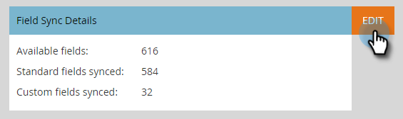

# Microsoft Dynamicsとのクイック同期を使用して新しいカスタムフィールドを作成する {#use-quick-sync-with-microsoft-dynamics-for-a-new-custom-field}

マーケティングまたは販売が新しいフィールドを必要としています。 または、最初のフィールド選択で忘れた場合もあります。 または、ニーズが変わった。 どのような場合でも、クイック同期を使用して特定のフィールドを再同期できます。

通常は、Quick Syncを使用して新しいフィールドを追加し、値を更新します。 ただし、既存のフィールドを同期する場合があります。 更新または作成した日付範囲に基づいて、フィールドの同期を制限できます。 詳しくは、 [後述の「アドバンス同期オプション](#Advanced_Sync_Options) 」を参照してください。

Quick SyncはNULL値を同期できます。 例えば、AとBの値を使用し、DynamicsのBの値をnullに変更すると、Null値はMarketoに同期されます。

## すべてのレコードのクイック同期 {#quick-sync-for-all-records}

クイック同期を使用して新しいフィールドを再同期する方法を次に示します。

1. Marketorで、「 **管理者**」をクリックします。

   

1. [** Microsoft Dynamics**]をクリックします。

   

1. 「フィールドの同期の詳細」で、「 **編集**」をクリックします。

   

1. クイック同期するフィールドを選択し、「 **保存**」をクリックします。

   

   >[!NOTE]
   >
   >複数のエンティティからフィールドを選択できます。

1. 同期が完了すると、通知が届きます。

   

   >[!CAUTION]
   >
   >同期は他の同期と並行して実行され、データベースのサイズによっては、完了に長い時間がかかる場合があります。 フィールドが同期待ちキューにある場合は、選択を解除できません。

## 詳細な同期オプション {#advanced-sync-options}

既存のフィールドを同期し、限られたデータセットに対してのみ同期する場合はどうしますか。 これが方法です。

1. 既存のフィールドのチェックボックスをオフにします。 「 **保存**」をクリックします。

   

1. ポップアップを再度開き、フィールドを選択し直します。

   

1. 「 **詳細同期**」をクリックします。

   

1. 「**更新済み**」を選択し、日付選択ツールを使用して日付範囲を選択します。 「 **保存**」をクリックします。

   

   2016年8月19日から2016年9月19日の間に更新されたレコードのみが、フィールド用にQuick Syncedされます。

## 非同期フィールドの修正 {#fixing-out-of-sync-fields}

まれに、DynamicsとMarketoのフィールドが同期されない場合は、すばやく簡単に再同期できます。

1. フィールドの選択を解除し、「 **保存**」をクリックします。

   

1. フィールドを再選択し、「 **保存**」をクリックします。 それだけだ！

   

   それで直せ！

