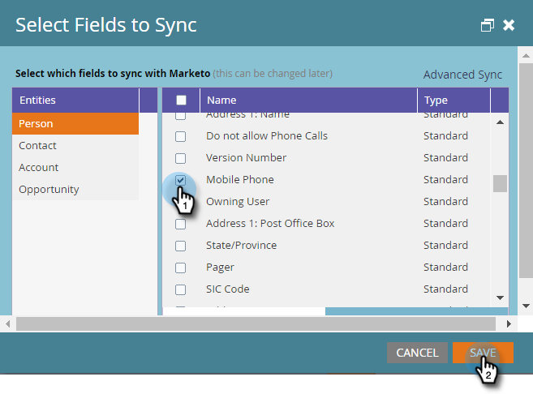

# 新しいカスタムフィールドに [!DNL Microsoft Dynamics] とクイック同期を使用する {#use-quick-sync-with-microsoft-dynamics-for-a-new-custom-field}

マーケティングまたはセールスが新しいフィールドを希望しています。または、最初のフィールド選択で 1 つ選択し忘れた場合もあります。または、ニーズが変更された場合も考えられます。どのような場合でも、クイック同期を使用して特定のフィールドを再同期できます。

通常は、クイック同期を使用して新しいフィールドを追加し、値を更新します。 ただし、既存のフィールドを同期する場合もあります。更新または作成した日付範囲に基づいて、フィールドの同期を制限できます。詳しくは、以下の[詳細同期オプション](#Advanced_Sync_Options)を参照してください。

クイック同期では、null 値を同期できます。例えば、値 A と B を使用し、[!DNL Dynamics] の B 値を null に変更すると、null 値がMarketoに同期されます。

## すべてのレコードのクイック同期 {#quick-sync-for-all-records}

ここでは、クイック同期を使用して新しいフィールドを再同期する方法を説明します。

1. Marketo で、「**[!UICONTROL 管理者]**」をクリックします。

   

1. 「**[!UICONTROL Microsoft Dynamics]**」をクリックします。

   

1. [!UICONTROL &#x200B; フィールド同期の詳細 &#x200B;] で、**[!UICONTROL 編集]** をクリックします。

   

1. クイック同期するフィールドを選択し、「**[!UICONTROL 保存]**」をクリックします。

   

   >[!NOTE]
   >
   >複数のエンティティからフィールドを選択できます。

1. 同期が完了すると、通知が届きます。

   

   >[!CAUTION]
   >
   >同期は他の同期と並行して実行され、データベースのサイズによっては、完了までに長い時間がかかる場合があります。同期待ちのキューに入っているフィールドの選択を解除することはできません。

## 詳細同期オプション {#advanced-sync-options}

既存のフィールドを限られたデータセットに対してのみ同期する場合は、どうすればいいですか？手順は以下のとおりです。

1. 既存のフィールドのチェックボックスをオフにします。「**[!UICONTROL 保存]**」をクリックします。

   

1. ポップアップを再度開き、フィールドを再選択します。

   

1. 「**[!UICONTROL 詳細同期]**」をクリックします。

   

1. 「**[!UICONTROL 更新済み]**」を選択し、日付選択ツールを使用して日付範囲を選択します。「**[!UICONTROL 保存]**」をクリックします。

   

   フィールドのクイック同期は、2016/8/19～2016/9/16 の間に更新されたレコードにのみ実行されます。

## 非同期フィールドの修正 {#fixing-out-of-sync-fields}

[!DNL Dynamics] フィールドとMarketo フィールドの同期が取れていない場合は、すばやく簡単に再同期できます。

1. フィールドの選択を解除し、「**[!UICONTROL 保存]**」をクリックします。

   

1. フィールドを再選択し、「**[!UICONTROL 保存]** をクリックします。

   

   これで修正されます。
