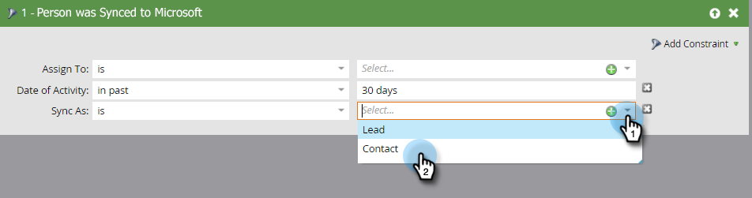

# Microsoft Dynamics での連絡先の作成 {#create-a-contact-in-microsoft-dynamics}

1. Dynamics で連絡先として作成する Marketo 専用人物（Microsoft Type が空）を選択します。

   

1. **人物アクション**／**Microsoft** をクリックし、「**人物を Microsoft に同期**」を選択します。

   

1. 「**名前を付けて同期**」をクリックし、「**連絡先**」を選択します。「**今すぐ実行**」をクリックします。

   

   >[!NOTE]
   >
   >「人物を Microsoft に同期」フローアクション（トリガーキャンペーン内のみ）を使用した場合、リード／連絡先は Dynamics でリアルタイムに作成されます。

1. Marketo は、Dynamics のリードレコードを、Dynamics のどのアカウントにも関連付けられていない連絡先に限定します。

   

1. スマートキャンペーンフィルターで「名前を付けて同期」制約を使用する場合に「**連絡先**」を選択できるようになります。

   
